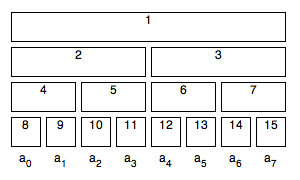

양의 정수 $N$이 2의 지수라고 하자. 길이가 $N$인 배열 $a$의 각 원소를 $a_i$라고 하자$(i \in [0, N-1])$. 어떤 원소 $a_i$를 수정하는 규칙이 있을 때, 이것을 $a_x$와 $a_y$ 사이 모든 원소들에 적용시킨다고 생각하자. 이것을 **Range modification**이라고 부를 것이다. 

결합법칙(Associative property)과 교환법칙(Commutative property)을 만족하고 항등원(identity element)를 가지는 어떤 이진연산을 예를 들어 $\times$로 나타내자. $a_x$와 $a_y$ 사이 모든 원소들간에 연산을 적용한 결과 $(a_x \times a_{x+1} \times ... \times a_{y-1} \times a_y)$를 요구한다고 생각하자. 이것을 **Range query**라고 부를 것이다.

Range query와 modification을 $O(\log N)$에 수행하고 $O(N)$의 공간을 요구하는 non-recuersive algorithm을 소개한다.



위의 그림은 크기가 8인 배열에 대해 구성된 structure를 도식화 시킨 것이다. 이는 4개의 레이어로 이뤄져 있다 ($log_2N+1$개의 레이어). 각 레이어는 **range**들을 포함한다. range들은 서로 겹치지 않으면서도 배열의 모든 부분을 포함시킨다. 같은 레이어에 있는 range들은 같은 크기를 가지며, 상위 레이어로 갈수록 크기가 지수적으로 증가한다. 모든 range는 row-major 순으로 왼쪽에서 오른쪽으로, 위에서 아래순으로 번호가 매겨진다. 가장 아래쪽 레이어(*N* ~ *2N-1*)는 $a_i$의 값을 가지게 된다. 그 외 range들은 해당 구간에 맞는 query의 값을 가진다.

이 자료구조를 Segment tree나 Interval tree로도 부르기도 한다. 그러나 이 자료구조를 트리로 취급해도 전혀 **유용하지 않다**.

## Range Query over Static Array

먼저 modifications을 제쳐놓고 range query를 구현하는 방법에 대해 알아보자. 우선 이 자료구조가 built되어 있는 상태라고 가정하자. 다음은 '덧셈'에 대한 range query의 구현이다. (초기값 0은 덧셈의 항등원이다)

```cpp
int staticQuery(int L, int R) {
    L += N;
    R += N;

    int sum = 0;

    for (; L <= R; L = (L + 1) >> 1, R = (R - 1) >> 1) {
        if (L & 1) {
            sum += a[L];
        }

        if (!(R & 1)) {
            sum += a[R];
        }
    }

    return sum;
}
```

$a_i$ 원소는 이 structure상의 인덱스$i+N$에 위치한다. 이 사실로부터 처음 두 명령문을 설명할 수 있다: query의 구간 경계값을 맨 아래 레이어의 인덱스로 바꾸는 것이다. 다음 명령문은 *sum*를 연산의 identity로 초기화한다. 이 변수에 구간에 해당하는 연산값을 누적한 답을 구해서 반환하게 된다.

이제 for-반복문에서 *L*, *R* 인덱스가 어떻게 바뀌는지 알아보자. 아래의 그림은 *staticQuery(3, 7)*가 거치는 구간을 색으로 나타낸 것이다. 노란색은 무시되는 부분, 빨간색은 연산에 포함되는 부분이다. 빨간색 영역은 겹치지 않고 합쳐서 3~7의 구간을 나타내는 것으로 보인다.

.png)

간결함을 위해 먼저 *L* 인덱스가 어떻게 움직이는지 설명하겠다. *L*이 홀수면 *a[L]*은 반드시 결과에 포함되어야 한다. *a[L]*을 포함하는 다른 범위들(*L*=11의 경우, 1, 2, 5번 range)은 query's range에 없는$a_i$값에 의해 달라지기 때문이다. 첫 번째 조건문에서 이 부분을 확인한다. 당연히 *L*이 짝수면 *a[L]*은 무시한다. '*a[L]*을 포함하면서 더 넓고 query's range를 넘어서지 않는 구간'(이하 **covering range)**가 존재하기 때문이다. (*L*=6인 경우 3번 ranger가 존재하므로 무시된다)

그림에서 짐작할 수 있듯이 다음으로 검사할 범위는 *L/2* 인덱스이다(*L*이 짝수인 경우). 일반적으로 *L*을 2의 지수로 나누면 covering range들을 얻을 수 있다. *L*이 홀수인 경우는 covering range가 필요가 없기에 신경쓰지 않는다. 다음 필요한 구간은 현재 구간의 오른편에 존재한다. 두 경우 모두 *L = (L+1) >> 1*으로 다음 range를 찾을 수 있다. (*L*이 짝수인 경우, *L*을 2로 나눈 것과 동일하다. *L*이 홀수인 경우, 오른쪽으로 인덱스를 옮겨 covering range를 찾는다고 생각할 수 있다)

*R* 인덱스도 비슷하다. 오른쪽 끝을 나타내기 때문에 좌우로 뒤집혀서 적용이 된다. 따라서 두번째 조건문과 *R*의 대입연산이 대칭적이다. *L*과 *R*이 만나서 *L>R*이 되면 반복문을 끝나고 query's range가 모두 포함된다.

**Note 1.** 연산에 교환법칙(commutative property)을 요구하지 않는 방법으로 알고리즘을 구현할 수 있다. 심지어 항등원의 필요를 무시할 수도 있다.

**Note 2.** 연산이 idempotent(여러 번 적용하더라도 연산의 결과가 달라지지 않는 성질)하다면 두 조건문을 다 생략하고 다음 한 줄만 쓸 수 있다. 이 경우는 minimum을 예시로 들었다.

```cpp
m = min(m, min(a[L], a[R]));
```

minimim의 항등원는 0이 아닌 positive infinity임에 주의하라.

**Note 3.** multidimensional query에 쉽게 적용할 수 있다. 다음은 2차원에서의 query를 처리하는 예이다.

```cpp
int staticQuery2D(int x1, int x2, int y1, int y2){
    x1 += N;
    x2 += N;

    int sum = 0;

    for (; x1 <= x2; x1 = (x1 + 1) >> 1, x2 = (x2 - 1) >> 1){
        int i1 = y1 + N;
        int i2 = y2 + N;
        for (; i1 <= i2; i1 = (i1 + 1) >> 1, i2 = (i2 - 1) >> 1){
            if (x1 & 1){
                if (i1 & 1){
                    sum += a[x1][i1];
                }
                if (!(i2 & 1)){
                    sum += a[x1][i2];
                }
            }

            if (!(x2 & 1)){
                if (i1 & 1){
                    sum += a[x2][i1];
                }
                if (!(i2 & 1)){
                    sum += a[x2][i2];
                }
            }
        }
    }

    return sum;
}
```

## Modification of Single $a_i$ Element

Single element modification은 두 단계로 이뤄진다. 첫 번째, $i+N$ 인덱스에 저장된 $a_i$를 수정한다. 두 번째, 이 원소를 포함하는 모든 covering range를 올라가면서 갱신한다.

```cpp
void pop(int i) {
    a[i >> 1] = a[i] + a[i ^ 1];
}

void popUp(int i) {
    for (; i > 1; i >> 1) {
        pop(i);
    }
}
```

우린 이미 *popUp()*이 어떻게 covering range들을 열거하는지 알고 있으므로 바로 서브루틴에 대해 설명하겠다. 연산이 *i*와 *i^1* 인덱스에 적용되는 것을 볼 수 있다. 두 range가 *i >> 1*의 subrange임을 어렵지 않게 알 수 있다. 서브루틴에서의 해당 연산이 성립하는 이유는 결합법칙(associatve property)가 성립하기 때문이다.

**위 code는 교환법칙이 성립하지 않는 연산에 적용할 수 없음에 유의하라**(range들을 합치는 과정에서 연산 순서가 바뀔 수 있다).

자명하게도 structure build에 이 single element modification을 쓸 수 있다. 각 modification은 $O(logN)$의 시간 복잡도를 가지므로 build하는데 O(NlogN)이 걸린다. 반면, 다음 code로 $O(N)$에 수행할 수 있다. (가장 아래 레이어에서 값들을 올리는 것은 동일하다)

```cpp
void buildUp() {
    for (int i = 2 * N - 1; i > 1; i -= 2) {
        pop(i);
 }
}
```

## Range Query within $O(log^2N)$ after Transparent Range Modifications

다른 파라미터를 가지는 일련의 range modification들을 생각하자. 배열에 이 modification들을 '어떠한 순서'로 적용시켜 나오는 배열의 상태가 있을 것이다. 이제 원래 array에 같은 modification을 '다른 순서'로 시켜 나오는 배열의 상태를 생각해보자. 결과는 전자와 같을 수도 다를 수도 있다. 만약 결과가 순서에 따라 달라지지 않는다면 그러한 modification을 **transparent**라고 할 것이다. 예를 들어 "[1, 3] 구간의 값들을 모두 5 증가시키기"는 transparent modification이다.

수정하려는 range가 임의가 아닌 structure상 표현이라고 하자. 우리는 간단하게 그 값을 수정해버릴 수 있지만, structure를 inconsistent state로 두게 된다. 비록 우리는 어떻게 covering range를 갱신할지 알지만, 각각의 모든 modification을 적용하지 않을 것이다. 임의의 range에 modification을 적용할 때, 'covering range를 갱신하는 더 효율적인 방법'이 있기 때문이다. 그래서 우리는 covering range가 어떻게든 consistent하게 된다고 가정한다. 그러나 여전히 inconstent한 subrange도 있을 것이다. 우리는 당연하게도 직접 갱신하지 않는다. 수정해야할 원소의 수가 $O(N)$이기 때문이다. 대신 우리는 *modifier* 변수를 추가로 사용하는데 '모든 subrange에 수정을 가상으로 적용시키는 파라미터'를 저장할 것이다. 다음은 파라미터 *p*를 받아 증가 연산을 수행하는 코드이다.

```cpp
void modifierHelper(int i,int p) {
    a[i] += p * q[i];
    m[i] += p;
}
```

두 줄의 명령문은 같아보이지만, 다른 의미이다. 첫 번째 명령문은 파라미터 p를 사용하여 modification 자체를 수행한다. 두 번째 명령문은 modification의 파라미터를 저장한다. 전체 modification을 m[i]와 p를 파라미터로 하는 modification을 연속적으로 수행한다고 보는 것이다(위에서 설명한 Range Query를 처리하는 과정과 유사한 방법).

q[i]는 range i에 포함되는 원소 수를 뜻한다. q[i]값을 계산하는 제일 직접적인 방법은 다음 루틴을 쓰는 것이다. 이것은 buildUp()과 비슷하다.

```cpp
void makeQ(){
    for(int i = N; i <= 2*N - 1; i++) {
        q[i] = 1;
    }
    for(int i = 2*n-1; i > 1; i -= 2) {
        q[i >> 1] = q[i] + q[i ^ 2];
    }
}
```

이제, 어떻게 임의의 modification을 적용하는 알아보자. 우린 이미 *staticQuery()* 에서 어떻게 임의의 범위를 표현했는지 알고있다. 다음 코드는 increment modification을 수행한다.

```cpp
void pop(int i) {
    a[i >> 1] = (a[i] + m[i >> 1] * q[i]) + (a[i ^ 1] + m[i >> 1] * q[i ^ 1]);
}

void modify(int L, int R, int p) {
    L += N;
    R += N;

    int LCopy = L;
    int RCopy = R;

    for (; L <= R; L = (L + 1) >> 1, R = (R - 1) >> 1) {
        if (L & 1) {
            modifierHelper(L, p);
        }
        if (!(R & 1)) {
            modifierHelper(R, p);
        }
    }

    popUp(LCopy);
    popUp(RCopy);
}
```

마지막 두 명령문은 앞서 언급한 'covering range를 갱신하는 더 효율적인 방법'이다. 둘에 대해서만 pop up시켜도 충분하다. *pop()* 서브루틴이 변경된 점을 주목하길 바란다*. i* 와 *i-1* range는 covering range의 *modifier* 에 영향을 받기 때문이다.

> live하게 말하면 modifier m는 "내 밑에 node들은 모두 m[i]만큼 modify시켜라"라는 뜻이다. 그래서 뒤에 나오는 query 처리시 위에 있는 covering range의 modifier를 모두 확인한다. i range가 p만큼 갱신될 때 modifierHelper()가 수행하는 일은 다음처럼 설명할 수 있다.
> 
> ```cpp
> m[i] += p // range i가 포함하는 subrange의 modifier들을 모두 p만큼 갱신시킨다
> a[i] += p // range i의 modifier도 p만큼 갱신시킨다
> ```

이제, 어떻게 range query들을 어떻게 처리하는지 알아보자. 그냥 staticQuery()를 쓸 수 없다. query에 걸쳐있는 range들이 상위 레이어의 modifier들로부터 영향을 받기 때문이다. 해당 range에 저장된 실제 값을 찾기 위해, 우리는 모든 covering range의 modifier를 반영하는 서브루틴을 쓸 것이다.

```cpp
int realValue(int i){
    int v = a[i];

    for(int j = i >> 1; j > 0; j >>= 1){
        v += m[j] * q[i];
    }
}
```

그리고 다음 코드로 range query를 처리한다.

```cpp
int log2Query(int L,int R){
    L += N;
    R += N;

    int sum = 0;

    for(; L <= R; L = (L + 1) >> 1, R = (R - 1) >> 1) {
        if(L & 1) {
            sum += realValue(L);
        }
        if(!(R & 1)) {
            sum += realValue(R);
        }
    }

    return sum;
}
```

## Range Query and Opaque Range Modification within $O(logN)$

Transparent와 반대로, **opaque** modification의 결과는 연산의 순서에 의존한다. 반면에 transparent modification은 opaque하다고 볼 수 있으며, opaque한 경우가 transparent한 것보다 더 일반적이라고 할 수 있다. Range assignment와 Range sum query를 예로 들어 설명한다. (Range assignment는 범위 내의 각 값들을 원하는 값 p로 바꾼다)
 
realValue()를 이용한 간단한 트릭은 더 이상 작동하지 않을 것이다. 이 modification는 하위레이어가 상위레이어의 modifiers로부터 영향을 받기 때문이다. 우리는 갱신해야할 범위에서 modifier를 분리하는 방법이 필요하다. 그 방법은 "push down"이다. 이 방법은 해당 범위에서 modifier를 제거하고 밑에 있는 두 subrange로 연산을 넘기기 때문에 붙여진 이름이다.

```cpp
void push(int i){
    if (h[i >> 1]){
        modifierHelper(i, m[i >> 1]);
        modifierHelper(i^1, m[i >> 1]);
        h[i >> 1] = false;
    }    
}

void pushDown(int i){
    int k;
    for(k = 0; (i >> k) > 0; k++);
    for(k -= 2; k >= 0; k--){
        push(i >> k);
    }
}
```

우선 pushDown()을 먼저 보자. popUp()과 같은 인덱스들을 나열하는 것은 같지만 역순으로 거쳐간다는 점만 알면 된다. push down은 위에서 아래로 전파하기 때문에 역순이 요구되는 것이다.
 
이제 push()를 보자. 새로운 값인 h[i >> 1]이 있는데, 이는 i >> 1에 modifier가 붙어있으면 true값을, 아니면 false값을 같는다. 이 프로시저는 해당 range에 modifier가 존재하면 이 값을 두 subrange에 붙이고 마킹을 해제하는 기능을 한다.
 
Range assignment와 sum query들을 지원하기 위해 새로운 서브루틴인 modifierHelper()와 pop()이 필요하다. 두 서브루틴이 어떻게 동작하는지 이해하는 것은 어렵지 않을 것이다.

```cpp
void modifierHelper(int i,int p){
    a[i] = p * q[i];
    m[i] = p;
    h[i] = true;
}

void pop(int i){
    if(h[i >> 1]) {
        a[i >> 1] = m[i >> 1] * q[i >> 1];
    } else {
        a[i >> 1] = a[i] + a[a ^ i];
    }
}
```

자명하게도, 우리는 필요한 모든 push down이 이뤄진 후 range를 직접적으로 수정할 수 있다. 오직 두 번의 push down만 하면 된다. 다음은 Range assignment를 수행하는 코드이다.

```cpp
void modify(int L,int R,int p) {
    L += N;
    R += N;

    int LCopy = L;
    int RCopy = R;

    pushDown(LCopy);
    pushDown(RCopy);

    for(; L <= R; L = (L + 1) >> 1, R = (R - 1) >> 1) {
        if(L & 1) {
            modifierHelper(L, p);
        }
        if(!(R & 1)) {
            modifierHelper(R, p);
        }

    popUp(LCopy);
    popUp(RCopy);
    }
}
```

Range sum query에서도 완전 동일하다.

```cpp
int query(int L,int R){
    L += N;
    R += N;

    pushDown(L);
    pushDown(R);

    int sum = 0;

    for(; L <= R; L = (L + 1) >> 1, R = (R - 1) >> 1){
        if(L & 1){
            sum += a[L];
        }
        if(!(R & 1)){
            sum += a[R];
        }
    }

    return sum;
}
```

**Note 4.** 때때로 h[i]값 사용을 하지 않을 수도 있다. "정의되지 않은" modifier을 통해 각 경우를 분리할 수 있다.

**Note 5.** modification이 tarsparent한 경우, *modify()*에 있는 push down을 생략 할 수 있다. 또한 *query()*에서도 push down을 생략할 수는 있지만. 두 명령문을 제거하는 것만큼 쉽지는 않다.

### 놀라운 사실!

맨 처음 $N$이 2의 지수라고 가정했지만 사실 여기서 소개한 모든 알고리즘들은 모든 양의 정수 $N$에서 동작한다. 따라서 어떠한 크기 $N$의 배열에 대해서도 이 structure가 필요한하 추가적인 공간 크기는$O(N)$이다.

원문 : https://codeforces.com/blog/entry/18051

틀린 내용 대부분 수정은 했지만 남아있을 수 있음
