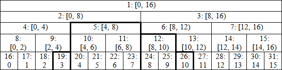

원문 : <https://codeforces.com/blog/entry/18051>

## Segment tree with single elment modifications

Segment tree는 한 배열에서 몇 번의 변경이나 연속된 부분에 대한 query들을 처리할 때 사용한다. 첫번째 예로 다음 두 명령어를 생각해두자. 

1. 배열에 있는 한 원소를 수정한다.

2. 어떤 범위에 대한 원소들의 합을 찾는다.

### Perfect binary tree

다음 segment tree를 도식화한 것이다.



표기법은 node_index: corresponding segment [left border included, right excluded)이다, 트리의 leaf에 해당하는 맨 밑에 행은 우리의 배열에 해당한다. Perfect binary tree가 되도록 배열 크기가 2의 지수(예에서는 16)라고 가정하자. 트리를 올라가면서 index가 (2i, 2i+1)인 노드 쌍을 골라 값을 합쳐서 index가 i인 부모 노드로 값에 저장한다. 이 방법을 따르면 [3, 11)의 합을 찾을 때, index가 19, 5, 12, 26인 노드만 더하면 된다. 8개의 각 원소값을 모두 더하지 않는다.

C++로 다음과 같이 구현할 수 있다.

```cpp
const int N = 1e5; // limit for array size
int n; // array size
int t[2 * N];

void build(){ // build the tree
    for(int i=n-1; i>0; --i)
        t[i] = t[i<<1] + t[i<<1|1];
}

void modify(int p,int value){
    for(t[p+=n] = value; p>1; p>>=1)
        t[p>>1] = t[p] + t[p^1];
}

int query(int l,int r){ // sum on interval [l, r)
    int res = 0;
    for(l += n, r+= n; l < r; l >>= 1, r >>= 1){
        if(l&1) res += t[l++];
        if(r&1) res += t[--r];
    }
    return res;
}

int main(){
    scanf("%d",&n);
    for(int i=0;i<n;++i)
        scanf("%d", t+n+i);
    build();
    modify(0, 1);
    printf("%d\n",query(3, 11));
    return 0;
}
```

5개의 argument를 쓰는 recursive한 구현보다 간단하다. 해당 구현이 어떻게 작동하고 효율적인지 알아보자.

1.  위의 그림에서 알 수 있듯이, leaf node들은 index가 n으로 시작하여 tree에 연속되게 저장된다. $i$번째 element는 tree의 index $i+n$에 해당되는 node에 저장된다. 그래서 처음 배열의 값을 tree 위치에 바로 입력받을 수 있다.

2. Query들을 처리하기 전에 tree를 build 해야하는데 꽤 간단하며 $O(n)$에 수행된다. 부모 node들은 항상 자식 node들 보다 index가 낮기 때문에 모든 internal node들을 decreasing order로 처리한다. bit연산자가 이해하기 힘들 수 있는데, *bulid()*의 bitwize는 `t[i] = t[2*i] + t[2*i+1]`와 같다.

3. '하나의 element를 수정하는 연산' 역시 간단하며 트리의 높이와 같은 $O(log(n))$에 수행된다. 수정하려는 node의 부모 node들만 수정하면 된다. node p의 부모 node의 index는 p/2(`p>>1`)이므로 bitwise로 tree위로 올라갈 수 있다. 자식 node의 index가 2i일 때, 부모 node를 가지는 또 다른 child는 2i+1이다(반대도 마찬가지). `p^1`는 p가 2i이면 2i+1를, 2i+1이면 2i를 구할 수 있다.

4. '특정 구간에 대한 연산'을 구하는 것도 $O(log(n))$에 수행된다. 예로 든 [3, 11)의 쿼리가 정확히 19, 26, 12, 5 노드 순서로 합쳐짐을 확인할 수 있다.

I일반적인 생각은 다음과 같다. Left interval border을 l이라 하자, l가 홀수면(l&1 == true) l은 부모의 오른쪽 child 노드이다. 찾는 범위는 l을 포함하지만 그 부모노드는 포함하지 않는다. 따라서 우리는 t[l]을 더하고 l = (l+1)/2연산으로 l부모의 오른쪽  노드로 이동한다. 반면 l이 짝수면 왼쪽 child이고 찾는 범위는 부모노드를 포함할 것이다(오른쪽 경계가 걸리지 않는 한). 따라서 우리는 바로 l = l/2연산으로 부모로 이동한다. Right border도 비슷한 논리로 접근할 수 있다. 두 border가 만나면 멈추게 된다.

Recursion이나 middle point와 같은 추가적인 연산없이 필요한 노드에 바로 접근하므로 매우 효율적이다.

### Arbitrary sized array

지금까지 배열크기를 2의 지수형태라 가정했기 때문에 Perfect binary tree임이 보장되었다. 다음 사실은 꽤나 멋지다.

**위의 코드는 어떤 크기 $n$에 대해서도 작동한다.**

이에 대한 설명은 더 복잡하기 때문에, 먼저 이 방법에 대한 장점에 대해 알아보자.

1. 정확히 $2n$의 memory를 사용한다. 다른 구현들은 $4n$의 memory를 사용한다.
2. 배열의 원소들은 index $n$으로 시작하는 위치에 차례로 저장된다.
3. 모든 operation들은 매우 효율적이고 작성이 간단하다.

$n=13$일 경우, tree를 도식화하면 다음과 같다.

.png)

더 이상 '하나의 트리'가 아닌 '여러 perfect binary tree의 묶음'이다: node 2를 root로 하고 높이가 4인 tree, node 7을 root로 하고 높이가 2인 tree, 12를 root로 하고 높이가 2인  tree, 13을 root로하고 높이가 1인 tree로 이뤄진 집합으로 볼 수 있다. '--'로 표현된 노드들은 query 연산에 전혀 쓰이지 않으므로 어떤 값이 저장되든 상관없다. 각 leaft들이 다른 높이에 있는 것으로 보인다. 그러나 node 13 이전 부분을 자른 오른쪽 부분을 왼편으로 붙이면 높이가 일정해진다. 결과적으로 이 구조는 우리가 연산을 적용시킬 때 큰 perfect binary tree의 일부분과 같은 구조처럼 보일 수 있다. 그리고 우리가 정확한 결과값을 얻을 수 있는 이유일 것이다.

형식화된 증명은 생략하고, [0, 7)을 예시로 들어보자.
범위는 l=13, r=20으로 시작한다. l&1이므로 t[13]을 더하고
범위는 l=7,  r=10으로 갱신된다. l&1이므로 t[7]을 더하고
범위는 l=4, r=5로 갱신된다. (node의 높이가 같아졌음을 알 수 있다.) r&1이므로 t[4]를 더하고
범위는 l=2, r=2로 갱신되고 종료한다.

### Modification on interval, single element access

명령어가 반대라면, 사람들은 힘겨워하거나 매우 복잡하게 만들고는 한다. 예를 들면:
  1. 어떤 범위의 모든 원소에 값을 더한다.
  2. 어떤 위치의 원소값을 계산한다.

그런데 이 경우 코드에서 modift와 query를 다음처럼 바꾸기만 하면 된다.

```cpp
void modify(int l,int r,int value){
    for (l += n, r += n; l < r; l >>= 1, r >>= 1){
        if (l&1) t[l++] += value;
        if (r&1) t[--r] += value;
    }
}

int query(int p){
    int ret = 0;
    for (p += n; p > 0; p >>= 1) res += t[p];
    return res;
}
```

원소 수정이 일어난 후에 배열에 있는 모든 원소를 검사해야한다면, 다음 코드를 통해 모든 수정사항을 leaf 노드에 push해줄 수 있다. 그 후, index n부터 시작해서 쭉 읽으면 된다. 이 방법은 시간복잡도를 $O(nlogn)$에서 $O(n)$으로 감소시킨다. tree build시 n번의 modification 대신 쓴 build함수와 비슷하다.

```cpp
void push() {
    for (int i = 1; i < n; ++i) {
        t[i<<1] += t[i];
        t[i<<1|1] += t[i];
        t[i] = 0;
    }
}
```

그러나 위의 코드는 modifications on a single element의 순서가 결과에 영향을 주지 않는 경우에만 동작한다. 예를 들어 Assignment는 이 조건을 만족하지 않는다. 자세한 내용은 **Lazy propagation** 부분을 참고하길 바란다.

### Non-commutative combiner functions

지금부터 간단한 combiner 함수인 덧셈에 대해서만 고려하자. 덧셈은 commutative property를 만족한다. 이는 피연산자의 순서는 상관없다는 뜻이고 $a+b=b+a$이다. $\min$과 $\max$에도 똑같이 적용할 수 있다. 그래서 우리는 '+'가 일어나는 모든 부분을 다른 함수로 바꾸기만 하면 된다. 그러나 query 결과값을 0 대신 infinity값으로 초기화해야 한다.

그런데, combiner 함수가 commputative하지 않는 경우가 있다. 예를 들면 [380C - Sereja and Brackets](https://codeforces.com/contest/380/problem/C)문제가 해당된다. 다행스럽게 이런 경우도 쉽게 적용할 수 있다. 구조체 S와 이를 위한 *combine()* 함수를 정의하자. *build*에서 '+'를 이 함수로 바꾸기만 하면 된다. *modify*함수에서 왼쪽 child가 짝수 index를 가지도록 노드에 대한 올바른 순서를 보장해야 한다. 쿼리를 답할 때, left border는 왼쪽에서 오른쪽으로 진행되고 right border는 오른쪽에서 왼쪽으로 진행된다는 점을 주목해야한다. 우리는 다음과 같은 코드로 이를 표현할 수 있다.

```cpp
void modify(int p, const S& value) {
    for (t[p += n] = value; p >>= 1; ) t[p] = combine(t[p<<1], t[p<<1|1]);
}

S query(int l,int r){
    S resl, resr;
    for (l += n, r += n; l < r; l >>= 1, r >>= 1) {
        if (l&1) resl = combine(resl, t[l++]);
        if (r&1) resr = combine(t[--r], resr);
    }
    return combine(resl,resr);
}
```

## Lazy propagation

다음은 range query와 range modification을 모두 수행하는 lazy propagation에 대해 설명할 것이다. 첫번쨰로 우리는 다음 변수들이 추가로 필요하다.

```cpp
int h = sizeof(int) * 8 - __builtn_clz(n);
int d[N];
```

*h*는 tree의 높이이자 n의 가장 높은 비트이다. *d[i]*는 필요할 때 node *i*의 child에 전파되는 delayed operation이다(예제에서 더 명확해질 것이다). *d[]* 배열의 크기는 오직 N이다. 왜냐하면 leaf 노드들은 child가 없기 때문에 저장할 필요가 없다. - 그들은 child가 없다. 따라서 총 3n의 메모리를 필요로 한다.

이전에 *t[i]*는 해당 범위에 해당하는 값이라고 할 수 있었다. **지금부터는 그렇지 않다.** 우선 node *i*부터 root까지 경로(node *i*의 부모노드들)에 있는 모든 delayed operation을 적용해야 한다. *t[i]*는 이미 *d[i]*를 포함하고 있다고 가정함으로써 경로의 시작은 *i*가 아닌 *i*의 바로 위 부모 노드부터이다. (leaf 노드에 delay 배열을 없애기 위한 가정인 것 같다)

첫번째 예제인 [3,11)로 돌아가되, 범위내 모든 원소들을 수정하는 상황이라고 하자. 이를 위해 노드 19, 5, 12, 26에서 *t[i]*와 *d[i]*를 수정해야 한다. 그 뒤에 예를 들어 노드 22의 값을 묻는다면 우리는 노드 5에서 트리 밑으로 modification을 전파해야 한다. 우리가 수행한 modification이 트리의 위쪽 *t[i]*값에도 영향을 준다는 것을 유의하자: 노드 19는  노드 9, 4, 2, 1에 영향을, 노드 5는 노드 2, 1에 영향을 미친다. 다음 사실은 이 연산의 복잡도에 대단히 중요하다.

Modification on *[l, r]*은 '경계에 있는 leaf 노드(l+n, r+n-1)'의 부모 노드에 있는 *t[i]* 값에만 영향을 미친다. (간격 자체를 구성하는 값을 제외하고 - 루프를 위해 엑세스하는 값)

증명은 간단하다. left border를 처리할 때, 반복문에서 우리가 수정하는 노드는 항상 '부모의 오른쪽 child'이다. 그러면 이전의 모든 modification은 같은 부모의 왼쪽 child에서 이뤄졌다. 그게 아니라면 우리는 두 child 대신 parent를 처리할 것이다. 이것은 현재 직계 부모 역시 leaf l+n의 부모임을 의미한다. right border도 비슷하게 접근할 수 있다.

### Increment modifications, queries for maximum

아마도 가장 간단한 경우가 아닐까 싶다. 아래의 코드는 보편적인 코드와는 거리가 멀고 가장 효율적이지도 않지만 (배우는)시작점으로 좋다.

```cpp
void apply(int p,int value) {
    t[p] += value;
    if (p < n) d[p] += value;
}

void build(int p) {
    while(p > 1)
        p >>= 1, t[p] = max(t[p<<1], t[p<<1|1]) + d[p];
}

void push(int p) {
    for (int s = h; s > 0; --s) {
        int i = p >> s;
        if(d[i] != 0) {
            apply(i<<1, d[i]);
            apply(i<<1|1, d[i]);
            d[i] = 0;
        }
    }
}

void inc(int l,int r,int value) {
    l += n, r +=n ;
    int l0 = l, r0 = r;
    for(; l < r; l >>= 1, r >>=1) {
        if (l&1) apply(l++, value);
        if (r&1) apply(--r, value);
    }
    build(l0);
    build(r0-1);
}

int query(int l,int r){
    l += n, r += n;
    push(l);
    push(r - 1);
    int res = -2e9;
    for(; l < r; l >>= 1, r >>= 1){
        if (l&1) res = max(res, t[l++]);
        if (r&1) res = max(t[--r], res);
    }
    return res;
}
```

한번에 한 method식 분석해보자. 처음 세 method들은 굳이 알 필요없는 helper들이다.

1. 우리는 모든 내부 노드들마다 두 변수(*t[i]*, *d[i]*)가 있기 때문에 두 변수에 변경사항을 적용시키는 method 작성이 쉽다.  *p < n* 조건문은 p가 leaf 노드가 아닌지 확인한다. 우리가 하려는 연산의 중요한 원리는 '어떤 범위에 대해 모든 원소가 같은 값으로 증가하면 가장 큰 원소는 같은 값만큼 증가한다'는 것이다.

2. *build*는 주어진 노드의 모든 부모 노드를 갱신한다.

3. push는 주어진 노드의 부모 노드들로부터 변경사항을 (루트에서 시작하는 트리의 아래 방향으로) 전파한다 ~. 이 부모 노드들은 정확하게 이진법으로 나타낸 *p*의 앞부분이다. 이것이 부모 노드 계산을 위해 binary shift 연산을 하는 이유이다.

이제 main method를 보자.

1. 위에서 설명했듯이, 이미 익숙한 loop 문을 통해 증가 요청을 처리한다. 그 다음에 *build*를 불러 필요한 모든 것을 갱신한다.

2. Query에 답하기 위해 우리는 같은 loop를 사용하지만 쓰일 노드에 대해 모든 변경사항을 push해야 한다. *build*와 비슷하게, leaf노드의 부모노드로부터 변경사항을 push해도 충분하다.

모든 연산이 $O(log(n))$임을 쉽게 알 수 있다.

다시말하면 이 경우는 다음 두 이유 떄문에 가장 쉬운 경우이다.

  1. modification의 순서가 결과에 영향을 주지 않는다.

  2. 노드를 갱신할 때, 노드에 해당하는 범위의 길이를 몰라도 된다.

다음 예제를 통해 이를 고려해보자.

### Assignment modifications, sum queries

다음은 추가적으로 쓰일 보조 함수이다.

```cpp
void calc(int p, int k) {
    if (d[p] == 0) t[p] = t[p<<1] + t[p<<1|1];
    else t[p] = d[p] * k;
}

void apply(int p, int value, int k) {
    t[p] = value * k;
    if (p < n) d[p] = value;
}
```

노드 p의 값을 계산하고 변경사항을 적용하는 간단한 $O(1)$ 함수이다. 여기에 두 가지 설명할 점이 있다.

1. modification에 절대 사용하지 않는 값이 있다고 가정하자. 이 경우는 0을 사용하지 않는다고 하자. 이런 값을 설정하지 않는다면 — d[p] == 0을 확인하는 대신 추가적인 boolean 배열을 만들어 참조할 수 있다.

2. 노드 *p*에 해당하는 범위의 길이를 의미하는 파라미터 k가 추가되었다. 이 의미를 보존하기 위해 코드에서도 이 이름을 일관되게 사용할 것이다. 당연하게도 이 파라미터 없이 합을 계산하는 것은 불가능하다. 별도의 배열에 모든 노드에 대한 값을 전처리 해놓거나 그때그때 노드 인덱스로부터 계산한다면 이 파라미터 사용을 피할 수 있다. 그러나 이러한 방법은 추가적인 메모리나 연산을 하게 된다는 것을 보게 될 것이다.

다음은 *build*와 *push* method를 업데이트해줘야 한다. 이 method들은 두가지 버전에 있었다. 하나는 이전에 설명했던 tree 전체를 처리하는 $O(n)$이고 다른 하나는 마지막 예제였던 하나의 leaf의 부모들만 $O(\log n)$에 처리하는 것이었다. 둘의 기능을 쉽게 하나의 method로 합쳐 더 많은 것을 얻을 수 있다.

```cpp
void build(int l,int r){
    int k = 2;
    for(l += n, r += n-1; l > 1; k <<= 1){
        l >>= 1, r >>= 1;
        for(int i = r; i >= 1; --i) calc(i, k);
    }
}

void push(int l,int r) {
    int s = h, k = 1 << (h-1);
    for (l += n, r += n-1; s > 0; --s, k >>= 1)
        for(int i = l >> s; i <= r >> s; ++i) if (d[i] != 0) {
            apply(i<<1, d[i], k);
            apply(i<<1|1, d[i], k);
            d[i] = 0;
        }
}
```

두 method는 어떤 범위에서도 $O(\log n + \left\vert r - l \right\vert)$에 동작한다. 만약 트리의 interval을 바꾸고 싶다면 다음과 같이 코드를 쓸 수 있다.

```cpp
push(l, r);
... // do anything we want with elements in interval [l, r)
build(l, r);
```

어떻게 동작하는지 설명한다. 처음에 제대로 부모 노드를 계산하기 위해 r += n-1로 닫힌 구간으로 바꾼다. 트리를 레벨별로 처리하는데 현재 간격의 레벨을 2의 지수 형태로 유지하기 쉽지 않기 때문이다. *build*는 밑에서 위로 진행된다. 따라서 *k*를 2로 초기화하고(1이 아니다. leaf 노드에서는 아무것도 계산하지 않고 바로 위 부모로부터 시작하기 때문이다) 각 층마다 두배로 만든다. *push*는 위에서 밑으로 진행된다. 따라서 k는 트리의 높이에 의존하며 각 레벨에서 반으로 나누면서 진행한다.

Main method는 마지막 예제랑 크게 다르지 않지만 *modify*에 대해 두가지 유의점이 있다.

  1. modifiction의 순서가 중요하기 때문에 루트로부터의 모든 경로에 대해 오래된 변경사항이 없는지 확인해야 한다. query에서 했던 것처럼 *push*를 호출함으로써 해결한다.

  2. *k* 값을 유지해야 한다.

```cpp
void modify(int l, int r, int value) {
    if (value == 0) return;
    push(l, l + 1);
    push(r - 1, r);
    int l0 = l, r0 = r, k = 1;
    for(l += n, r += n; l < r; l >>= 1, r >>= 1, k <<= 1){
        if (l&1) apply(l++, value, k);
        if (r&1) apply(--r, value, k);
    }
    build(l0, l0 + 1);
    build(r0 - 1, r0);
}

int query(int l, int r) {
    push(l, l + 1);
    push(r - 1, r);
    int ret = 0;
    for(l += n, r += n; l < r; l >>= 1, r >>= 1) {
        if (l&1) res += t[l++];
        if (r&1) res += t[--r];
    }
    return res;
}
```

거의 같은 노드를 세번 지나친다는 점을 알 수 있다: push에서 한번 내려갔다가 두 번 올라간다. 마지막 패스는 생략하고 필요할 때마다 새 값을 계산할 수 있지만 코드가 더 복잡해진다.

```cpp
void modify(int l, int r, int value){
    if (value == 0) return;
    push(l, l + 1);
    push(r - 1, r);
    bool cl = false, cr = false;
    int k = 1;
    for(l += n, r += n; l < r; l >>= 1, r >> = 1, k <<= 1) {
        if (cl) calc(l - 1, k);
        if (cr) calc(r, k);
        if (l&1) apply(l++, value, k), cl = true;
        if (r&1) apply(--r, value, k), cr = true;
    }
    for(--l; r > 0; l >>= 1, r >>= 1, k <<= 1){
        if (cl) calc(l, k);
        if (cr && (!cl || l != r)) calc(r, k);
    }
}
```

Boolean flag들은 이미 왼쪽과 오른쪽을 변경했는지를 나타낸다. 예시를 보자.

.png)

[4, 13) 범위를 수정하자.
  1. l = 20, r = 29, call apply(28)
  2. l = 10, r = 14, call calc(14) - 현재 범위에서 오른쪽에서 첫번째 노드는 정확하게 수정되는 마지막 노드의 부모이다.
  3. l = 5, r = 7, call calc(7) and then call apply(5) and apply(6)
  4. l = 3, r = 3, 첫 번째 loop 종료

이제 --l 가 수행되는 지점을 봐야한다. 노드 2,3을 계산하고 노드 1을 계산해야하기 때문이다. 종료문이 r > 0인 이유는 첫번째 loop문 후에 l=1, r=1가 된 경우 루트를 갱신해야 하지만 --l 수행 후 l = 0이 되기 때문이다.

이전의 구현과 비교하면, 필요없는 호출인 *cacl(10)*, *calc(5)*과 중복된 호출인 *calc(1)*을 피했다.
