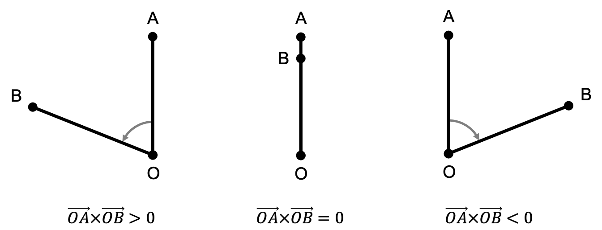
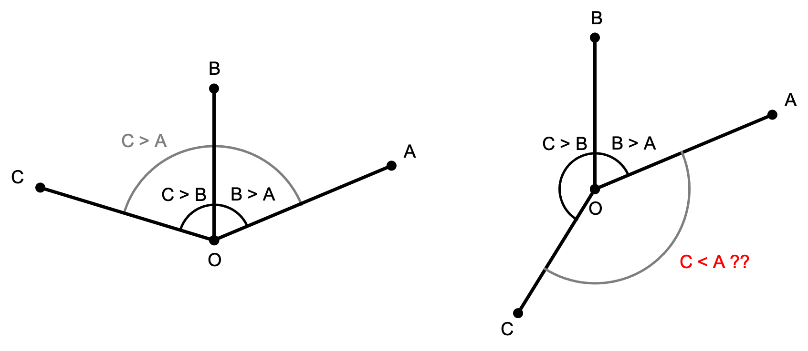
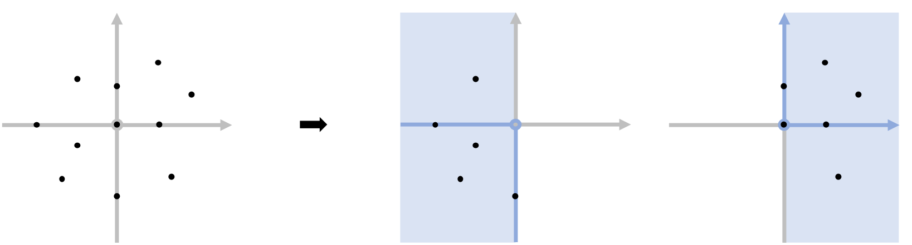
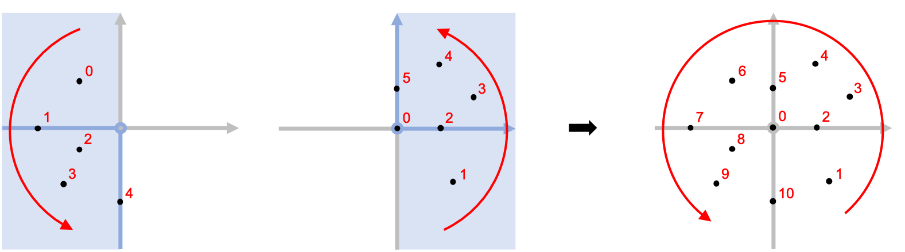

2차원 좌표평면 상의 점들을 기준점에 대해 반시계 방향 순서로 정렬하는 방법에 대해 알아보겠습니다.

## 외적을 이용한 방향성 판별

세 점 $O$, $A$, $B$의 방향성은 외적을 통해 판단할 수 있습니다. 외적 $\overrightarrow{OA} \times \overrightarrow{OB}$의 외적이 0보다 크면 반시계 방향(Counter Clock Wise)으로, $0$보다 작으면 시계 방향(Clock Wise)으로, $0$이면 일직선 상에 위치하게 됩니다.



이를 코드로 나타내면 다음과 같습니다.

```cpp
using lint = long long;

struct pt{
    lint x, y;
    bool operator < (const pt &o) const {
        return x<o.x || (x==o.x && y<o.y); }
};

int ccw(pt o,pt a,pt b){
    lint c = (a.x-o.x)*(b.y-o.y) - (a.y-o.y)*(b.x-o.x);
    if(c > 0) return 1; // 반 시계 방향
    if(c < 0) return -1; // 시계 방향
    return 0; // 일직선 상
}
```

## 비교 연산자

기준점 $O$에 대한 두 점의 외적이 0보다 큰 지 판단하면 모든 점을 각도 정렬할 수 있을 것 같습니다. 하지만 실제로 이렇게 비교 연산자를 정의하면 오류가 발생합니다. 모든 두 점 사이의 각이 $\pi$보다 작으면 대소관계에 문제가 없지만, 사이의 각이 $\pi$이상이면 [strict weak ordering](https://en.cppreference.com/w/cpp/named_req/Compare)가 성립하지 않기 때문입니다.



 이 부분은 기준점 $O$를 기준으로 두 영역으로 나눈 뒤, 같은 영역에 있을 경우에만 외적 값을 이용해 비교하는 방법으로 해결해줄 수 있습니다. 저는 (2사분면, 3사분면, -x축, -y축)과 (1사분면, 4사분면, +x축, +y축, 원점)으로 영역을 나눠줬습니다.



두 영역에 대해서는 임의로 순서를 정해주면 비교 연산이 성립하게 됩니다. 저는 오른쪽 영역이 먼저 오도록 정했습니다.



각도가 같은 경우, 상황에 맞게 순서를 정하면 됩니다. 일반적으로 원점에 가까운 순서로 정렬합니다.

#### 유의할 점

정렬해야할 점들에 원점도 있는 경우 주의해야 합니다. 원점은 항상 각도가 같을 때의 조건으로 비교하게 되는데, 이에 따라 원점의 등장 순서가 달라지기 때문입니다. 원점에 가까운 순서로 정하는 경우 가장 앞에 등장하게 되고, 원점에 먼 순서로 정하는 경우 오른쪽 영역의 가장 마지막에 등장하게 됩니다.

대부분의 문제는 원점을 포함하지 않거나 포함하더라도 원점의 순서는 상관없는 경우가 많습니다. 따라서 원점은 예외 처리가 필요할 수도 있다는 것만 유의하시면 되겠습니다.

## 구현

비교 연산에 필요한 외적은 $O(1)$에 구할 수 있으므로 $O(n \log n)$에 구현할 수 있습니다.

```cpp
pt o(0,0);
sort(p.begin(), p.end(), [&](pt p,pt q){
    if((p<o)^(q<o)) return q < p;
    if(int t = ccw(o,p,q)) return t > 0;
    return abs(p.x)<abs(q.x) || abs(p.y)<abs(q.y);
});
```
