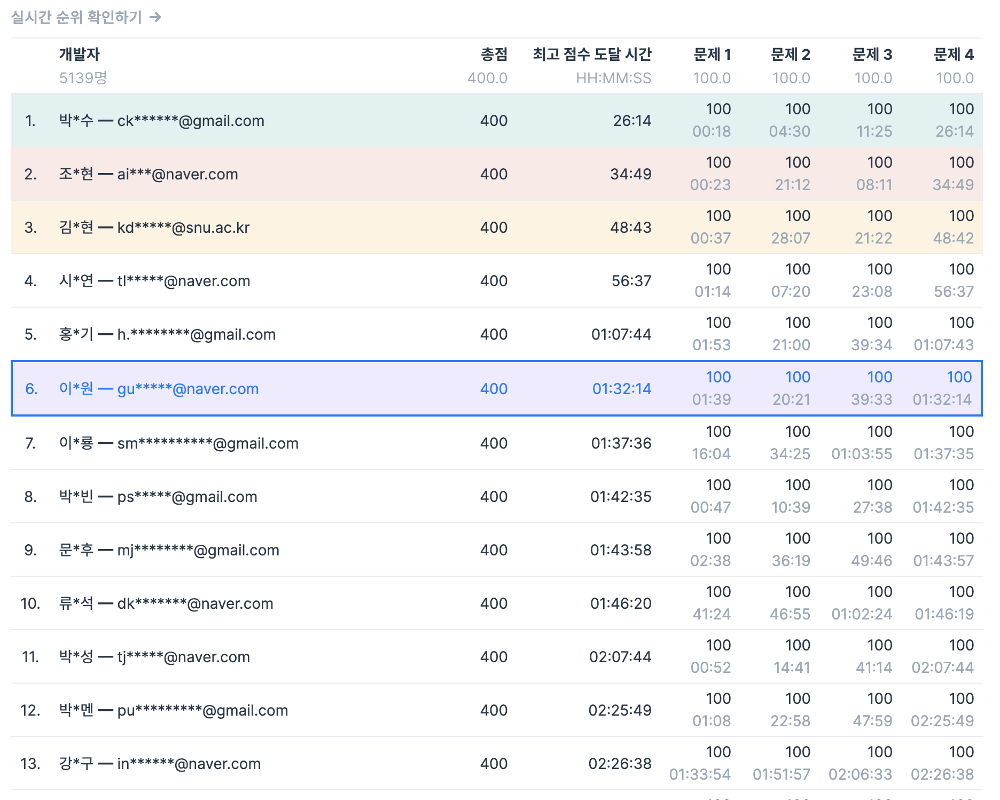
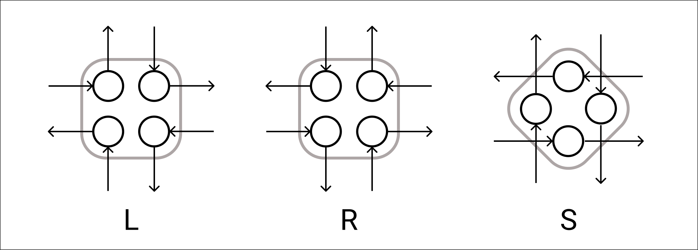

### 참가후기

전체 6등을 했다. 참 괜찮은 국내 알고리즘 대회 중 하나이지만 플랫폼의 단점이 많다. 테스트 케이스를 추가하는 과정이 번거롭고, 디버깅용 출력을 너무 많이 하면 또 실행이 안된다. 무엇보다도 대회 종료 전에 코드를 따로 백업해두지 않으면 작성한 코드가 모두 날아가는 것이 가장 불편하다.

깜박하고 코드를 백업해두지 않아서 이번에는 코드 없이 풀이만 올린다. ㅜㅜ

### A. 없는 숫자 더하기

$0$부터 $9$까지 숫자에 대해 배열을 순회하면서 없으면 답에 누적해주면 된다.

### B. 빛의 경로 사이클

각 격자칸을 네 개의 정점으로 나누면 다음과 같이 나타낼 수 있다.

이렇게 만들어진 그래프의 모든 정점의 indegree와 outdegree가 같기 때문에 연결된 모든 정점에 대한 오일러 경로가 존재한다. 게다가 indegree와 outdegree가 정확히 $1$이기 때문에 오일러 경로는 유일하다. 즉, 정확히 하나의 사이클이 만들어 지게 된다. 따라서 연결된 정점들의 집합인 컴포넌트 개수를 세주면 된다.

### C. 금과 은 운반하기

$t$ 시간에 금 $a$kg과 은 $b$kg을 전달할 수 있다면 $t+1$ 시간에도 전달가능 하다는 점에 착안하면 binary search로 접근할 수 있다. 그러면 $t$ 시간에 가능한지 결정하는 문제가 된다.

우선 최대한 금을 우선 싣고 남은 공간이 있다면 은을 실었다고 가정하고, 필요한 만큼 금을 은으로 교환하는 식으로 생각해볼 수 있다. 예를 들어, 트럭에 금 8kg와 은 2kg을 실었다고 가정했을 때 금 7kg과 은 3kg으로 바꿔 실으면 금 1kg과 은 1kg을 교환하는 것과 같다는 뜻이다. 금을 우선 실었는데도 부족하면 아예 불가능한 경우이므로 이를 제외하면, 금은 충분하고 은이 부족한 상태일 것이다. 이제 금을 $a$kg빼고 가능한만큼 모두 은으로 교환하여 $b$kg을 채울 수 있는지 확인해주면 된다.

$i$번 도시의 트럭이 도시를 최대 $\lfloor \frac{t + t_i}{2t_i} \rfloor$ 번 방문 가능하기 때문에 최대 $W_i = \min (g_i + s_i, \lfloor \frac{t + t_i}{2t_i} \rfloor \cdot w_i)$ kg의 광물을 운반할 수 있다. 금을 $G_i = min(W_i, g_i)$ 만큼 싣고 은을 $S_i = \min(W_i - min(W_i, g_i), s_i)$ 만큼 실어주면 총 ${E_i} = min(G_i, s_i - S_i)$만큼 교환 가능한 상태가 된다.

모든 $i$에 대해 $G_i$, $S_i$, $E_i$를 계산해두고 $\sum{G_i} \ge a \ \land \ \sum{S_i} + \min(\sum{E_i}, \sum{G_i} - a) \ge b$ 임을 확인해주면 된다. 이를 $O(N)$에 계산하면 전체 $O(N \log T)$에 해결할 수 있다.

### D. 안티세포

배열 $C$에 $i$를 $j$번 추가하려면 맨 뒤에 있는 $j$개의 안티세포들은 합이 $b[i] \cdot 2^{j-1}$, $b[i] \cdot 2^{j-2}$, $...$, $b[i] \cdot 2^0$이어야 한다. 뒤에서부터 순서대로 합쳐지면 $i$가 $j$번 추가되면서 합이 $b[i] \cdot 2^{j}$인 안티세포가 될 것이다.

배열 $C$에 $i$를 $j-1$번 추가할 수 있었고 여기에는 $[k,i]$ 구간의 안티 세포가 합쳐졌다는 사실을 안다고 하자. 이 때, $b[k-1] \cdot 2^p = b[i] \cdot 2^{j-1}$인 $p$가 존재하고 배열 $C$에 $k-1$을 $p$번 추가할 수 있다면 배열 $C$에 $i$를 $j$번 추가하는게 가능해진다. 이를 dp식으로 정리하자.

* $dp[i][j] :=$ (배열 $C$에 $i$를 $j$번 추가할 수 있는 경우의 수)

다음과 같이 점화식을 세울 수 있다.

* $dp[i][j] = \sum_{(p,k) \ \in \ \{p,k\ \vert \ b[k-1] \cdot 2^p = b[i] \cdot 2^{j-1} \} }{dp[k-1][p]}$

$j$는 가장 큰 경우 $\log(2e15)$까지 가능하기 때문에 dp테이블의 크기는 $O(N \log(2e15))$이고 각 $dp[i][j]$에 대해 $p$와 $k$를 binary search로 찾으면 전체 $O(N \log (2e15) \log N)$에 해결할 수 있다.

[공식 해설](https://prgms.tistory.com/101)에서 소개하는 정해는 $O(n \log \max b)$라고 한다.

