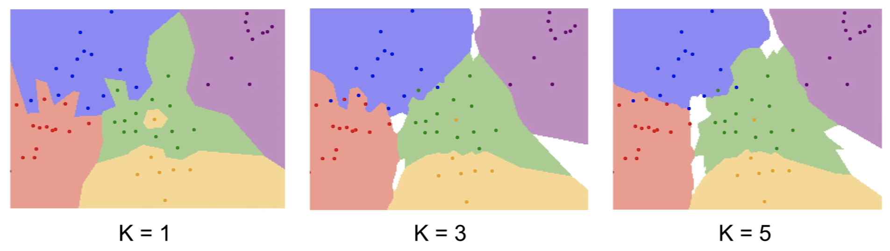
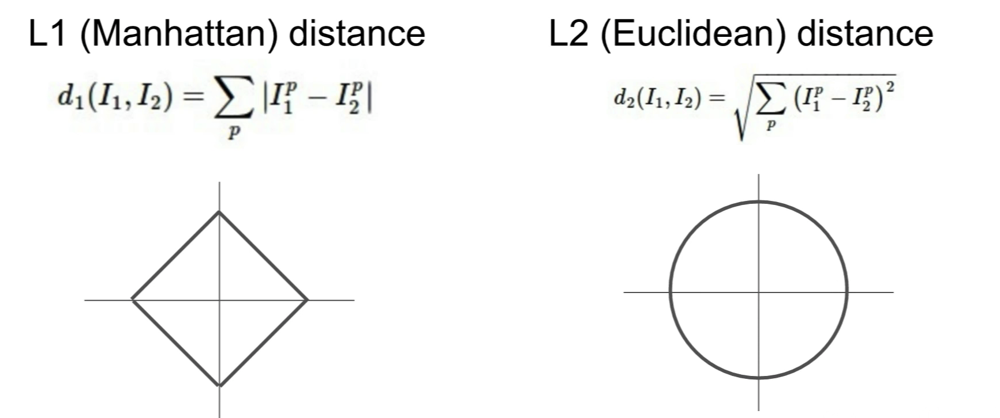
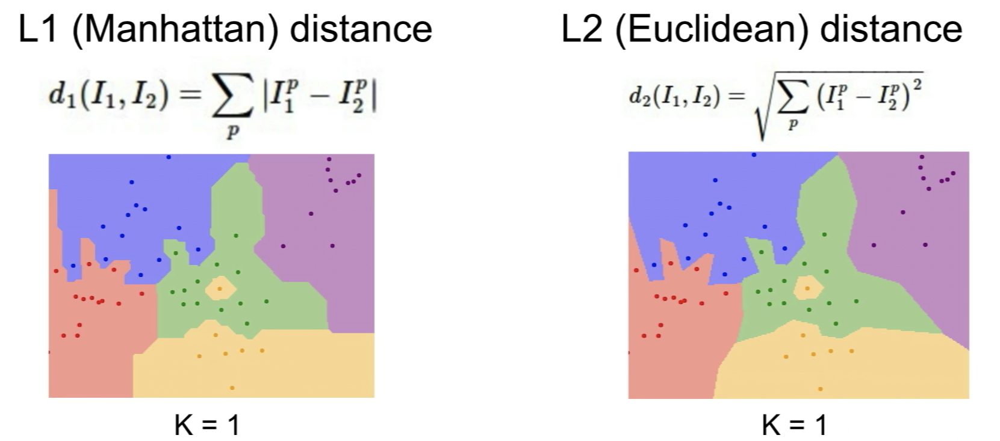
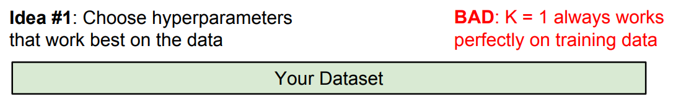
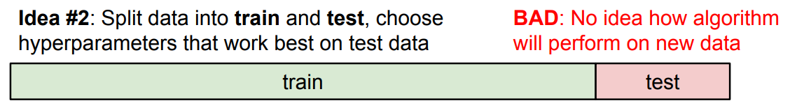
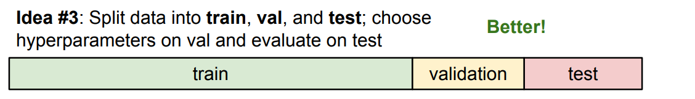
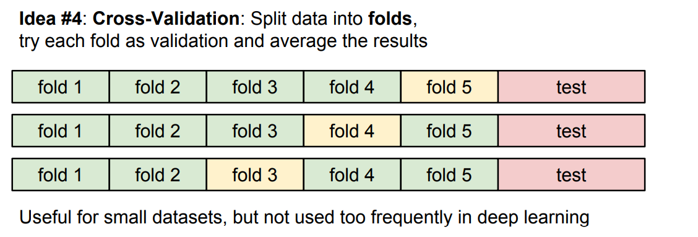
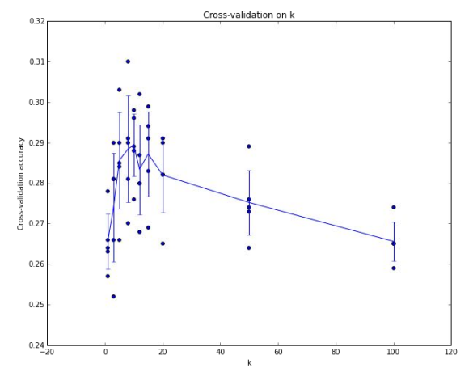
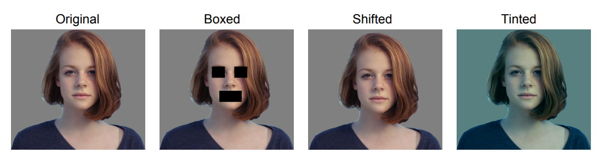

## 최근접 이웃 분류기(Nearest Neighbor Classifier)

최근접 이웃 분류기(nearest neighbor classifier)는 아주 단순한 분류기가 있다. 학습 단계에서는 아무 일도 하지 않고, 모든 학습 데이터를 저장만 한다. 그리고 예측 단계에서 새로운 이미지가 오면 기존 학습 데이터들과 비교해서 가장 유사한 이미지를 찾는다. 바로 이 가장 유사한 이미지와 레이블이 같다고 예측하는 방법이다. 

```python
def train(images, labels):
  # Memorize all data and labels
  return model

def predict(model, test_images):
  # Predict the label of the most similar training image
  return test_labes
```

여기서 중요한 점은 가장 유사한 이미지를 찾는 방법이다. 어떤 이미지 쌍이 있을 때의 거리(혹은 유사도)를 정의해야 한다. 이 정의에 따라 테스트 이미지 하나를 모든 학습 데이터와 비교해서 가장 가까운 거리의 학습 이미지를 찾을 수 있기 때문이다. 정확히 말해서 "어떤 비교 함수를 사용하는지"를 정하는 것이다.

예를 들어, 아주 간단한 방법인 L1 Distance(Manhattan distance)로 정해보자. 이미지의 각 픽셀마다 차이의 절대값을 계산해 수행결과를 모두 더한 값이 두 이미지 간의 거리가 된다.

$$
\mathbf{\mathsf{L1\,distance:}}\,\,\,\,\,\, d_1(I_1, I_2) = \sum_p \left| I_1^p - I_2^p \right|
$$

Python으로 구현하는 경우 NumPy에서 제공하는 벡터화 연산(vectorized operation)을 이용하면 짧고 간결하게 구현할 수 있다.

```python
import numpy as np

class NearestNeighbor:
  def __init__(self):
    pass

  def train(self, X, y):
    """ X is N x D where each row is an example. y is 1-dimension of size N """
    # the nearest neighbor classifier simply remembers all the training data
    self.Xtr = X
    self.ytr = y

  def predict(self, X):
    """ X is N x D where each row is an example we wish to predict label for """
    num_test = X.shape[0]
    # lets make sure that the output type matches the input type
    Ypred = np.zeros(num_test, dtype = self.ytr.dtype)

    # loop over all test rows
    for i in xrange(num_test):
      # find the nearest training image to the i'th test image
      # using the L1 distance (sum of absolute value differences)
      distances = np.sum(np.abs(self.Xtr - X[i,:]), axis = 1)
      min_index = np.argmin(distances) # get the index with smallest distance
      Ypred[i] = self.ytr[min_index] # predict the lable of the nearest example

      return Ypred
```

NN 분류기는 $N$개의 예제에 대해 학습에 $O(1)$, 예측에 $O(N)$의 시간복잡도를 가진다. 하지만 우리는 학습에 오래 걸리더라도 예측이 빠른 분류기가 필요하기 때문에 결코 좋은 상황이 아니다. 이런 관점에서, 이후에 살펴볼 CNN이나 다른 parametric model들은 정반대다. 학습에 얼마나 걸릴지는 모르지만 예측 시간은 매우 빠르다.

### K-최근접 이웃(K-Nearest Neighbor)

실제로 NN을 적용하는 경우 성능이 좋지 않다. 다음 그림은 NN의 결정 경계(decision region)다. 2차원 평면 위 모든 좌표에 대해 가장 가까운 학습 데이터를 찾은 뒤 해당 레이블로 색칠한 것이다.



NN에 해당하는 k=1의 그림을 보자. 가운데 영역은 대부분 초록색 영역이지만 노란점이 끼어있어 작은 노란색 영역이 생겼다. 이와 비슷하게 초록색도 파란색 영역을 침범하고 있다. 일반적인 상황에서 이런 점들은 **노이즈(noise)**나 **거짓(spurious) 데이터**이다. 이런 문제를 보완하여 NN의 일반화된 버전인 k-NN 알고리즘이 탄생했다.

k개의 가장 가까운 이웃들을 찾은 뒤, **다수결(majority vote)**을 통해 레이블을 결정하는 것이다. 다수결에는 거리별 가중치를 고려하는 등 다양한 방법이 있겠지만 가장 쉬운 방법은 득표수만 고려하는 것이다. k=3 경우 중앙의 노란 영역이 사라졌고, k=5의 경우 빨간색과 파란색 사이 경계도 부드러워 지는 것을 알 수 있다.

### 거리 척도(Distance Metric)

k-NN을 사용할 때, 어떤 거리 척도(Distance Metric)를 사용할지는 중요한 주제다. 거리 척도에 따라 공간에서의 기하학적 구조가 달라지기 때문이다. 앞의 예제에서 사용했던 L1 Distnace의 경우, 원점에서 모두 동일한 거리에 있는 점들의 집합을 나타내는 원을 그리면 사각형의 모습이다. 반면 L2 Distance(Euclidean Distance)의 경우, 우리가 아는 원 모양이다.



두 거리 척도 사이에는 재밌는 차이점이 존재하는데, L1 Distance는 좌표 시스템에 따라 큰 영향을 받는다는 것이다. 예를 들어, 기존 좌표계를 회전시키면 L2 Distance는 변하지 않지만 L1 Distance는 변한다. 만약 특징 벡터(feature vector)의 각 요소가 키, 몸무게와 같이 개별적인 의미를 가진다면 L1 Distance를 좋을 수 있다. 하지만 특징 벡터가 더 일반적이고 요소들간에 어떤 의미가 있는지 모른다면 L2 Distance가 좋을 수 있다.

동일한 데이터에 L1 Distance과 L2 Distance를 사용한 예제를 비교해보자. 결정 경계의 모양이 다르다는 것을 알 수 있다. 특히 L1 Distance의 경우, 좌표축에 영향을 받는다는 사실을 알 수 있다. 반면 L2 Distance의 경우, 경계가 더 자연스럽다.



다양한 거리 척도를 사용하면 k-NN으로 벡터나 이미지 외에도 다양한 데이터를 다룰 수 있다. 예를 들어, 두 문장 간의 거리를 측정하는 어떠한 것이든 거리로 둔다면 문장을 분류하는 문제에 적용해볼 수 있다.

## 하이퍼파라미터(Hyperparameters)

앞에서 설명한 k-NN에는 몇 가지 선택해야하는 항목이 있었다. k값과 거리 척도다. 이와 같이 알고리즘에 자체에 대한 선택을 결정짓는 항목들을 **하이퍼파라미터(hyperparameters)**라고 한다. 따라서 학습할 때 결정되는게 아니라 학습 전에 반드시 선택해야 한다. 일반적으로 하이퍼파라미터를 결정하는 작업은 문제와 데이터셋에 의존적(problem/dataset dependent)이다. 따라서 데이터에 맞게 "다양한 하이퍼파라미터 값으로 시도"해보고 "가장 좋은 값을 고르는 것"이 좋다.

우리가 일반적으로 모델을 학습시키고 평가할 때, 해볼 수 있는 실험 방법에 대해 생각해보자. 여기에도 다양한 방법이 있겠지만 단순하게 "학습 데이터의 정확도와 성능"을 최대화하는 하이퍼 파라미터를 고를 수 있다.



사실 이렇게 하면 k-NN에서는 하이퍼파라미터로 k=1을 고르게 될 것이고, 이는 앞선 예제들에서 보았듯이 유연성있고 부드러운 경계를 만들지 못한다. 궁극적으로 분류기는 학습 데이터가 아닌 한 번도 보지 못한 데이터를 얼마나 잘 예측하느냐가 중요한데 이를 평가할 수 없다.

또 다른 아이디어를 생각해보자. 전체 데이터셋 중의 일부를 테스트 데이터로 쓰는 것이다. 학습 데이터로 여러 하이퍼파라미터 값을 테스트 데이터에 적용해본 다음, 가장 성능이 좋은 하이퍼 파라미터를 고르는 것이다.



하지만 역시 이 방법도 절대 하면 안된다. 한 번도 보지 못한 데이터를 잘 맞추는 것이 아닌 주어진 테스트 데이터에 가장 잘 맞는 하이퍼 파라미터를 고르는 것이기 때문이다. 테스트 셋에서의 좋은 성능이 한 번도 보지 못한 데이터에서의 성능과 같다고 할 수는 없다.

훨씬 일반적인 방법은 바로 데이터를 세 가지 셋으로 나누는 것이다. 데이터의 대부분은 학습 셋(training set)이고, 일부는 검증 셋(validation set), 나머지는 테스트 셋(test set)이다. 다양한 하이퍼파라미터로 학습 셋을 학습시키고 검증 셋으로 성능을 검증한다. 여기서 최종적으로 검증 셋에서 가장 좋은 성능을 냈던 하이퍼파라미터를 선택한다. 마지막으로 이 선택한 하이퍼파라미터의 분류기로 테스트 셋으로 **단 한 번** 성능을 평가하는 것이다.



이렇게 나온 수치가 논문과 보고서에 삽입된다. 이렇게 하면 분류기가 한 번도 보지 못한 데이터에 대한 성능을 실질적으로 나타낼 수 있다.

>연구 논문을 작성할 때 테스트 셋은 거의 마지막 쯤에야 한 번 사용하며, 거의 마감 일주일 전부터만 사용한다고 한다. 정직하게 연구했고 논문의 수치가 공정하게 측정되었다는 걸 보장하기 하기 위함이다. 따라서 검증 셋과 테스트 셋을 엄격하게 나눠 놓는 건 상당히 중요하다.

또 다른 하이퍼파라미터 선택 전략은 교차 검증(cross-validation)이다. 우선 가장 마지막에 사용할 테스트 데이터를 빼놓고, 연습셋을 여러 부분으로 나눠준다. 그리고 번갈아가면서 검증셋의 역할을 하는 것이다.



위 에제는 5-Fold 교차 검증을 나타낸 것으로 초록색에 해당하는 4개의 fold로 하이퍼파라미터를 학습시키고 한 개의 노란색 fold로 평가한다. 이렇게 계속 순환하는 방식이다.

주로 데이터 셋이 작을 경우 사용하고 딥러닝에서는 많이 사용하지 않는다고 한다. 표준적인 방법이긴 하지만 딥러닝같이 큰 모델인 경우 학습 자체가 계산량이 많아서 적용하기 힘들다.

> **Q) 테스트 셋이 한 번도 보지 못한 데이터를 대표할 수 있을까?**
>
>기본적으로 "데이터는 독립적이며, 유일한 하나의 분포를 따른다"는 통계학적인 가정을 했다고 생각하면 된다. 그러므로 모든 데이터는 동일한 분포를 따른다고 생각할 수 있다. 물론 실제로는 그렇지 않은 경우가 많기 때문에 문제가 된다. 이런 문제는 데이터셋을 만들고 수집하는 사람이 생각해볼 문제다.
>
>예를 들어 데이터를 수집할 때, 일관된 방법으로 대량의 데이터를 한 번에 수집하는 전략을 사용한다고 한다. 데이터를 지속적으로 모으는 경우 특히 주의해야 하는데, 먼저 수집한 것을 학습데이터로 쓰고 이후에 모은 데이터를 테스트 데이터로 쓴다면 문제가 될 수 있다. 이를 완화하는 한가지 방법은 전체 데이터 셋을 무작위로 섞은 뒤 나누는 것이다.

다음은 5-Fold 교차 검증을 수행한 뒤의 결과를 나타낸 그래프다. x축은 k값, y축은 정확도를 나타낸다. 각 k값마다 5번의 교차 검증을 통해 알고리즘의 성능을 나타내고 있어 가장 좋은 하이퍼파라미터와 그 때 성능의 분산을 함께 알 수 있다. (이 데이터에서는 k=7일 때가 가장 좋아보인다.)



머신러닝 모델을 학습시키는 경우 보통 이런 모습의 그래프를 그린다. 하이퍼파라미터에 따른 모델의 정확도 및 성능을 평가할 수 있고 검증 셋에서 가장 좋은 성능을 보인 하이퍼파라미터를 고르게 된다.

### K-최근접 이웃(K-Nearest Neighbor)이 이미지에서 절대 쓰이지 않는 이유

앞서 얘기한 것처럼 너무 느리다. 또 다른 문제는 L1/L2 Distance가 이미지간 유사도를 측정하는데 적절하지 않다. 다음 여성 사진을 보자.



가장 오른쪽 원본 사진에 대해 눈과 입을 가려보고, 1픽셀 이동시켜보고, 파란색 톤으로 변형을 준 사진들이다. 이때 각 이미지는 원본과 모두 동일한 L2 Distance를 가지게 된다. 즉 세 장의 사진이 모두 같은 유사도를 가진다고 보기 때문에 결코 좋은 결과가 아니다.

다른 문제는 바로 *차원의 저주(curse of dimensionality)*다. k-NN은 결과적으로 학습 데이터로 공간을 적절히 잘 분할하는 작업이었다. 이것이 잘 동작하기 위해서는 전체 공간을 조밀하게 채울만큼의 충분한 학습 데이터가 필요하다. 이웃끼리 너무 멀면 제대로 된 분류가 힘들기 때문이다. 공간을 채우기 위해 필요한 데이터는 차원이 증가함에 따라 기하급수적으로 증가하는데, 고차원의 이미지인 경우 모든 공간을 채울만큼의 이미지를 모으는 것은 현실적으로 불가능하다.

---

가장 간단한 형태의 분류기(classifier)인 k-NN 분류기에 대해 학습해보았다. 이제 본격적으로 신경망의 기본적인 요소 중 하나인 Linear Classifier에 대해 알아보도록 하자. 