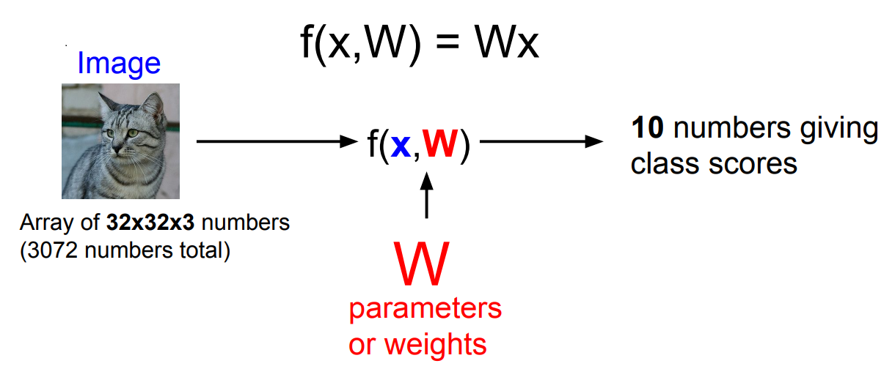
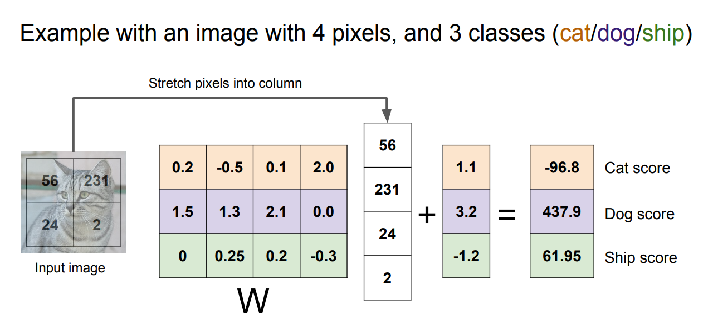
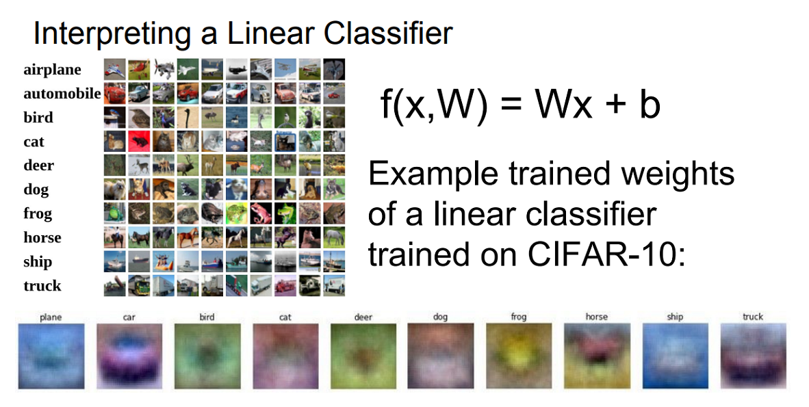
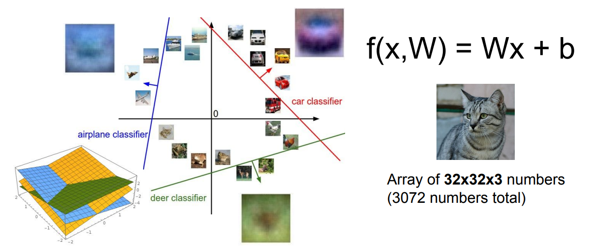
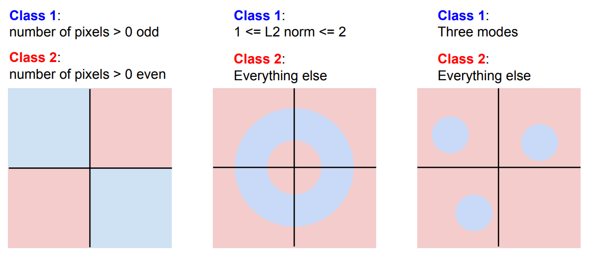

## Linear Classifier(선형 분류기)

Linear classifier(선형 분류기)는 간단하지만 중요하고 신경망과 CNN의 기반이 되는 알고리즘이다. 신경망을 레고블럭에 비유하기도 하는데, 다양한 컴포넌트들을 모아서 CNN이라는 타워를 짓는 셈이다. 앞으로 보게될 다양한 딥러닝 알고리즘의 가장 기본이 되는 블럭 중 하나가 Linear classifier이다.

### Parametric Approach: Linear Classifier

Linear Classifier는 parametric model의 가장 단순한 형태로 두 개의 요소를 가진다. 입력 이미지 $X$와 파라미터인 가중치 $W$이다. 이를 가지고 CIFAR-10 데이터의 10개의 클래스에 대한 각 10개의 점수를 함수 $f$를 통해 계산한다. 이때 각 점수가 높다는 것은 해당 클래스일 확률이 높다는 의미다.

앞서 배운 k-NN에서는 파라미터가 없던 것과는 다르게, parametric approach에서는 학습 데이터의 정보를 요약해 파라미터 $W$에 모아준다. 따라서 예측시 학습 데이터 대신 파라미터 $W$만 있으면 된다. 딥러닝은 바로 이 함수 $f$의 구조를 잘 설계하는 것이다. $W$와 데이터를 어떻게 조합할지 다양한 방법을 생각해보는 것이 NN 아키텍처를 설계하는 것과 같다.

가장 쉬운 방법은 그냥 $W$와 $X$를 곱하는 것이다. 이 방법이 바로 Linear Classification이다.

$$
f(X, W) = W \cdot X
$$

CIFAR-10 데이터 이미지의 크기는 $32 \times 32 \times 3$이고 이를 펴서 길이가 $3,072$인 하나의 열 벡터로 볼 수 있다. 이 벡터로부터 $10$개 카테고리의 각 점수를 나타내는 $10$개의 숫자를 얻어야 한다. 따라서 행렬 $W$의 크기는 $10 \times 3,072$가 되어야 한다. 가끔 Bias 항이 붙기도 하는데, 입력과 직접 연결되지는 않는다. 대신 데이터와 무관하게 특정 클래스에 우선권을 더 주는 식으로 작동한다.

가중치 행렬 $W$의 각 행은 클래스에 대한 템플릿으로 볼 수 있다. 이 행 벡터와 이미지의 열 벡터간의 내적을 계산하는데, 클래스마다 템플릿과의 유사도를 측정하는 것과 같다. 따라서 $W$의 각 행을 뽑아서 시각화해보면 Linear classifier가 이미지 인식을 위해 어떤 일을 하는지 짐작할 수 있다.

아래 그림은 CIFAR-10에서 학습한 $W$에서 각 클래스에 해당하는 행 벡터를 시각화 한 것이다.

비행기 클래스의 경우 분류할 때 푸른 색 위주로 가중치를 주고 있고, 자동차 클래스의 경우 자동차 앞면과 비슷한 것을 찾는다는 것을 알 수 있다.

### Linear Classification의 문제점

위에서 시각화한 말 템플릿을 보면 Linear classification의 문제점이 드러난다. 말의 머리가 두 개인 것처럼 템플릿이 학습되어 있다. 클래스마다 단 하나의 템플릿만 허용했기 때문에 이게 최선인 것이다.

이미지를 고차원 공간 내 하나의 점이라고 생각해보자. Linear classifier는 각 클래스를 구분시키는 선형적인 결정 경계와 같다. 비행기 클래스는 파란색 선을 학습해서 비행기와 다른 클래스를 구분하는 것이다.

하지만 다음 그림처럼 이런 방식으로 해결하기 어려운 경우가 대부분이다. 첫 번째 경우, 영상 내 사람 수가 홀/짝인지를 분류하는 Parity problem이 여기 해당한다. 마지막 경우, 한 클래스가 다양한 공간에 분포해있는 형태로 Multimodal problem이 여기 해당한다. 모두 일반적으로 Linear classification으로 해결하기 어려운 형태다.

Linear classification은 이러한 문제점이 있기는 하지만 쉽게 이해하고 해석할 수 있는 알고리즘이다.

---

Linear classifier의 수식을 살펴봤고, 단순한 행렬과 벡터의 곱 형태였다. 또한 템플릿 매칭과 유사하게 작동하며 각 클래스에 대해 하나의 템플릿을 학습한다는 것을 알 수 있었다. 앞으로 어떻게 적절한 가중치 행렬 $W$를 고르는지 학습 방법에 대해 배워보도록 하자.