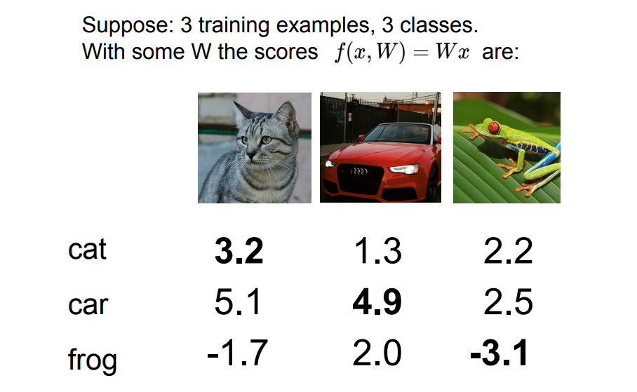
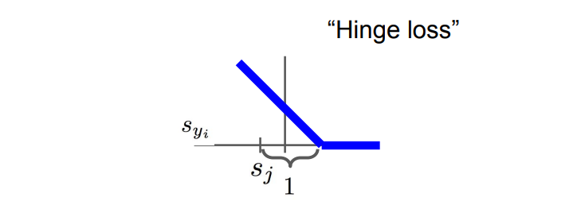
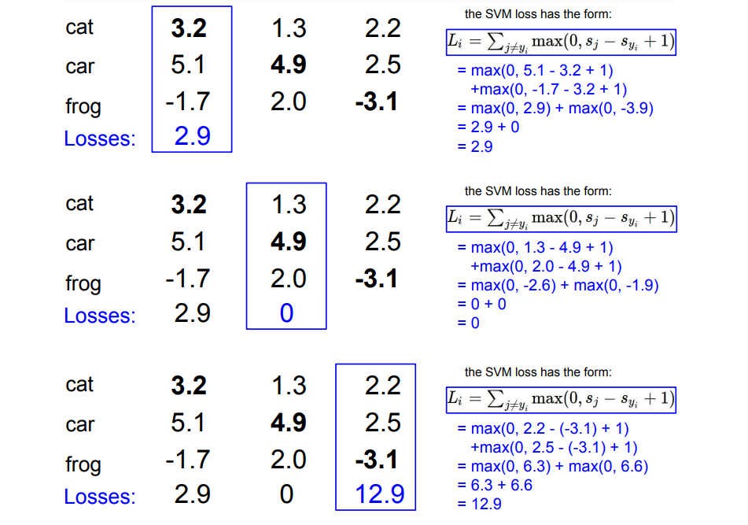

앞서 배운 Linear Classifier는 Parametric model의 일종이었다. Prametric Model은 학습 데이터의 정보가 파라미터인 행렬 $W$로 요약되는 것을 말한다. 이번 강의에서 가장 좋은 행렬 $W$를 구하기 위해 학습 데이터를 어떻게 활용하는지 알아보자.

## 손실 함수 (Loss Function)

좋은 $W$를 구하는 방법을 배우기 전에, 먼저 어떤 $W$가 좋은지 나쁜지를 정의해야 한다. 또 $W$가 좋다면 얼마나 좋은지 나쁘다면 얼마나 나쁜지를 알아야 한다. $W$를 입력으로 받아 클래스별 점수를 확인하여 얼마나 나쁜지를 정량적으로 나타내는 함수가 바로 **손실 함수(Loss function)**이다.



세 개의 학습 데이터와 세 개의 클래스로 이뤄진 예제를 통해  자동차 사진은 "car" 클래스의 점수가 높지만 고양이나 개구리 사진은 "cat", "frog"의 점수가 낮아 잘 분류되지 않았다. 이를 좀 더 공식화해보자.

입력 데이터를 $x_i$, 예측하고자하는 레이블(label) 혹은 타겟(target)을 $y_i$라고 하면, $N$개의 데이터로 이뤄진 전체 데이터셋은 다음과 같이 나타낼 수 있다.

$$
{\{(x_i,y_i)\}}^{N}_{i=1}
$$

10개의 클래스를 가지는 CIFAR-10의 이미지 데이터를 Image Classification하는 상황이라면, 각 이미지가 $x_i$가 될 것이고 정답 클래스($0$에서 $9$사이 정수)가 $y_i$가 될 것이다.

그 다음 손실함수를 $L_i$ 정의한다. 예측 함수 $f$와 정답 클래스 $y_i$를 입력받아 얼마나 나쁘게 예측했는지를 정량화한다. 그리고 최종 손실(Loss)인 $L$은 데이터셋에서 $N$개의 각 데이터에 대한 손실 $L_i$의 평균이 된다. 이는 아주 일반적인 공식이라고 한다.

$$
L = \dfrac{1}{N} \sum_{i}{L_i(f(x_i, W), y_i)}
$$

구체적인 손실 함수의 예시를 가지고 더 살펴보도록 하자.

## Multiclass SVM loss

다중 클래스 SVM(Multiclass SVM)는 여러 개의 클래스를 다루기 위한 이진 SVM의 일반화된 형태다. 예측한 점수 벡터를 $s = f(x_i, W)$라고 하자. 이때 각 학습 데이터의 Loss $L_i$는 다음과 같다.

$$
\begin{align}
L_i &= \sum_{j \neq y_i} \begin{cases} 0 & \mbox{if } s_{y_i} \ge s_j + 1 \\ s_j - s_{y_i} + 1 & \mbox{otherwise} \end{cases} \\
&= \sum_{j \neq y_i} \max(0, s_j - s_{y_i} + 1)
\end{align}
$$

먼저 $\sum$의 범위를 보면 "정답 클래스 $y_i$"를 제외한 "정답이 아닌 클래스 $j$"에 대한 합을 구한다는 사실을 알 수 있다. 즉, 정답이 아닌 클래스를 모두 합치는 것이다. 그리고 정답 클래스 $y_i$의 점수 $s_{y_i}$와 정답이 아닌 클래스 $j$의 점수 $s_j$를 비교한다.

만약 정답 클래스의 점수가 정답이 아닌 클래스의 점수보다 높다면($s_{y_i} > s_j$), 게다가 그 격차가 일정 마진(safety margin) $1$ 이상이라면($s_{y_i} \ge s_j + 1$) 정답 클래스가 다른 클래스들에 비해 충분히 높은 점수를 얻었다는 뜻이다. 따라서 이 경우는 Loss를 $0$으로 정한다. 그렇지 않은 경우, 그 차이 모두 합쳐 이미지 $x_i$의 최종 Loss로 정한다.

즉, Loss가 $0$이라는 것은 클래스가 잘 분류되었다는 뜻이고, 값이 클 수록 그만큼 나쁘게 분류되었다고 해석할 수 있다.

마지막으로 $\mbox{if-otherwise}$의 수식은 $\max(0, s_j - s_{y_j} + 1)$로 나타낼 수 있다. 이런 형태의 손실 함수를 **Hinge loss**라고도 부르는데 그래프 모양을 보고 붙여진 이름이다. (X축은 $s_{y_i}$, Y축은 Loss값)



앞선 예시에 대해 Loss를 계산하는 과정은 다음과 같다.



전체 학습 데이터의 최종 Loss인 각 데이터의 Loss의 평균은 $(2.9 + 0 + 12.9) / 3 = 5.27$이다. 이 Classifier가 5.3점만큼 학습 데이터를 나쁘게 분류하고 있다는 "정량적 지표"인 것이다.

**Q1. "Car" 점수가 약간 변하면 Loss값은 어떻게 될까?**

> SVM loss는 오직 정답 점수와 그 외 점수간 차이만을 고려한다. "Car" 점수가 다른 점수들보다 충분히 크기 때문에 서로 간의 간격(margin)은 유지되어 Loss는 변하지 않는다.

**Q2. SVM Loss가 가질 수 있는 최솟값/최댓값은 무엇일까?**

> 손실 함수가 Hinge Loss 모양임을 생각해보면, 최솟값은 $0$, 최댓값은 무한대가 될 수 있다.

**Q3. 처음부터 학습할 때 보통 파라미터 $W$를 임의의 작은 수로 초기화하는데, 그러면 결과 점수가 임의의 일정한 값을 가진다. 그렇다면 만약 모든 점수 $s$가 거의 $0$에 가깝고, 값이 서로 비슷하다면 SVM loss는 얼마가 될까?**

> 어떤 클래스의 점수가 정답 클래스의 점수와 비슷하다면 Margin값인 $1$만큼을 Loss로 가지게 될 것이다. 그러한 클래스가 정답 클래스를 제외한 $\mbox{#(class)} - 1$개 있으므로 SVM loss는 $\mbox{#(class)} - 1$가 된다.
>
> 이렇게 학습 초기에 어떤 Loss값을 가질 지 짐작할 수 있기 때문에 좋은 디버깅 전략이 될 수 있다. 처음 시작할 때 Loss가 $\mbox{#(class)} - 1$가 아니라면 버그를 의심해야 한다.

**Q4. 정답 클래스를 포함한 모든 클래스에 대한 Loss를 더하면 어떻게 될까?**

> Loss가 $1$ 증가할 뿐이다. 정답 클래스를 빼고 계산하는 이유는 Loss가 0이 될 때, 더 이상 나빠질 게 없다고 해석할 수 있기 때문이다.

**Q5. 전체 Loss의 합이 아닌 평균을 쓰면 어떻게 될까?**

> 영향을 미치지 않는다. 클래스의 수는 고정되어 있어, 손실 함수의 스케일만 변할 뿐이다. 실제 손실 함수 값이 몇인지는 중요하지 않다.

**Q6. 손실 함수를 $\sum_{j \neq y_i} \max(0, s_j - s_{y_i} + 1)$와 같이 제곱항으로 바꾸면 어떻게 될까?**

> 결과가 달라진다. 좋음과 나쁨 사이 trade-off를 비선형적으로 바꿔주게 되고 손실 함수의 계산 자체가 바뀌게 된다. 
>
> 실제로도 Squared Hinge Loss를 종종 사용하며, 손실 함수 설계시 사용할 수 있는 방법 중 하나이다. 둘 중 어느 loss를 선택할지는 어떤 에러를 신경쓰고 있고, 어떻게 정량화할지에 달려있다. 손실 함수는 알고리즘에게 내가 어떤 점을 에러로 보고 있는지, 어떤 에러가 trade-off되는지를 알려주는 것이다. 

**Q7. 만약 $L = 0$인 $W$를 찾았다고 가정했을 때 과연 $W$는 유일할까?**

> 그렇지 않다. $2W$를 생각해보면, 정답 클래스와 다른 클래스간 점수 차이가 두 배가 될 것이다. 이미 모든 차이가 margin $1$보다 크기 때문에 계속 Loss가 $0$이 된다.

### Multiclass SVM Loss: Example Code

참고로 다음과 같이 Numpy를 활용한 몇 줄의 코드면 이 손실 함수를 작성할 수 있다.

$$
\sum_{j \neq y_i} \max(0, s_j - s_{y_i} + 1)
$$

```python
def L_i_vertorized(x, y, W):
    scores = W.dot(x)
    margins = np.maximum(0, scores - scores[y] + 1)
    margins[y] = 0
    loss_i = np.sum(margins)
    return loss_i
```

## Regulazation

그렇다면 Loss를 $0$으로 만드는 손실 함수 $W$를 찾아 적용하면 되는 것일까? 기계 학습의 핵심은 학습 데이터를 이용해서 Classifier를 찾아내는 것인데, 이 Classifier는 테스트 데이터에 적용한다. 즉, 학습 데이터의 성능이 중요한 것이 아니라 테스트 데이터에서의 성능이 더 중요한 것이다. 오직 학습 데이터에 대한 Loss만을 고려해서 분류기를 학습한다면 아주 안 좋은 상황이 펼쳐진다. 다음 더 일반화시킨 예제를 보자.


학습 데이터들이 파란 점으로 표시되어 있다. 분류기는 손실 함수를 통해 어떤 곡선을 학습 데이터에 맞춰야한다는 것만 안다. 따라서 모든 학습 데이터를 완벽히 분류하기 위해 그림과 같은 구불구불한 곡선을 만들 것이다. 하지만 초록 점으로 표시되어 있는 테스트 데이터가 들어왔을 때 완전히 틀리게 된다. 의도한 선은 초록색 선이기 때문이다. 즉, 학습 데이터에 fit한게 아닌 테스트 데이터에 대한 성능을 늘 고려해야한다.

이 부분은 기계학습에서 가장 중요한 문제로 이를 해결하는 방법을 통틀어 **Regularization**이라고 한다. 보통 다음과 같이 손실함 수에 "Regularization term"을 하나 추가한다.

$$
\begin{array}{cc} L(W) =  \underbrace{\dfrac{1}{N} \sum^{N}_{i=1} L_i(f(x_i, W), y_i)}_{\mathsf{Data Loss}}
&+ \underbrace{\vphantom{\dfrac{1}{N}}{\lambda R(W)}}_{\mathsf{Regularization}} \end{array}
$$

* **Data loss**: 모델이 학습 데이터에 맞게 예측하도록 하는 항
* **Regularization**: 테스트 데이터에도 잘 동작하기 위해 모델을 단순(simple)화시키는 항


> 이때 "단순하다"는 개념은 해결하는 문제나 모델에 따라 조금식 달라진다. 과학계에서 널리 쓰이는 "Occam's Razor"라는 말이 있다. 만약 어떤 현상을 설명 가능한 가설이 다양하게 있다면, 일반적으로 "더 단순한 것"을 선호해야 한다는 것이다. 더 단순한(일반적인) 가설이 미래에 일어날 현상을 잘 설명할 가능성이 높기 때문이다. 이러한 직관을 기계 학습에 써먹기 위해 Regularization Penalty라는 것을 만들어낸 것이다.

다항 회귀(Polynomial Regression) 문제를 예로 들면, 일반적으로 모델은 높은 차수의 다항식을 이용해 해결하려고 할 것이다. 이때 Regression 항을 추가하면 모델이 낮은 차수의 다항식을 선호하도록 만드는 것이다. 그러므로 Regularization은 두 가지 역할을 하는 셈이다. 첫 번째는 모델이 더 복잡해지지 않게 하는 것이고 두 번째는 soft penalty를 추가하는 것이다. 따라서 모델에게 더 복잡해질 수 있는 가능성은 남아있다. 대신 "더 복잡한 모델을 쓰고 싶으면 이 정도의 penalty를 감수해야 한다"는 조건이 추가된 것이다.

$\lambda$는 하이퍼파라미터로 Data Loss 항과 Regularization 항 사이 trade-off를 결정한다. 보편적으로 사용되는 Regularization $R(W)$에는 다음과 같은 것들이 있다.

$$
\begin{array}{ll}
\begin{array}{ll}
\textbf{L2 regularization  } & R(W) = \sum_{k} \sum_{l} W^2_{k,l} \\
\textsf{L1 regularization  } & R(W) = \sum_{k} \sum_{l} |W_{k,l}| \\
\textsf{Elastic net (L1 + L2)  } & R(W) = \sum_{k} \sum_{l} \beta W^2_{k,l} + |W_{k,l}| \\
\end{array} \\
\begin{array}{ll}
\textsf{Max norm regularization} \\
\textsf{Dropout} \\
\textsf{Fancier: Batch normalization, Stochastic depth}
\end{array}
\end{array}
$$

L2 Regularization은 가중치 행렬 $W$에 대한 Euclidean Norm(Squared Norm)이다. 깔끔한 미분을 위해 $2$로 나눠주기도 한다. L1 Regularization은 L1-norm으로 $W$에 패널티를 부여한다. 이는 행렬 $W$가 희소(sparse) 행렬이 되도록 한다. 그리고 L1과 L2를 합친 Elastic net Regularization이 있다. 간혹 L1-norm, L2-norm 대신 Max-norm을 쓰는 Max norm Regularization도 보게 될 것이다.

이런 Regularization은 딥러닝 뿐만 아니라 많은 기계학습에서 자주 사용한다. 앞으로 Regularization 기법 중 Dropout, Batch Normalization, Stochastic depth와 같이 딥러닝에 관련된 기법들을 배우게 될 것이다.

### Regularization이 복잡도를 측정하는 법

여기 학습 데이터 $x$와 서로 다른 두 $w_1$, $w_2$가 있다.

$$
\begin{align}
x &= [1,1,1,1] \\
w_1 &= [1,0,0,0] \\
w_2 &= [0.25,0.25,0.25,0.25]
\end{align}
$$

Linear Classification 관점에서 $w1$과 $w2$는 $w_1^Tx = w_2^Tx = 1$로 같다. 이때 L2 Regularization은 더 norm이 작은 $w_2$를 선호하게 된다. 즉, Classifier의 복잡도를 거친(coarse) 정도로 측정하여 더 매끄러운 모델을 선호하는 것이다.

Linear Classification에서 $W$는 얼마나 $x$가 각 클래스와 닮았는지를 의미한다. 그러므로 L2 Regularization은 $x$의 모든 요소가 점수에 영향을 줬으면하는 것이다. 변동이 심한 $x$에 대해 $x$의 특정 요소에만 의존하는 것보다 모든 $x$의 요소가 골고루 영향을 미치길 원한다면 L2 Regularization가 적합하다. L1 Regularization은 정반대로 "복잡도"를 정의한다. 가중치 $W$에 있는 $0$의 개수에 따라 모델의 복잡도를 측정한다. 위의 경우에서는 $w_1$을 더 선호한다.

이처럼 문제에 따라 복잡도를 어떻게 정의할지 각 Regularization들이 복잡도를 어떻게 측정할지 달라진다. 따라서 가지고 있는 문제와 모델, 데이터를 고려해서 "복잡하다"는 것을 어떻게 정의할지 반드시 고민해야한다.

## Softmax

Multiclass SVM loss외에도 특히 딥러닝에서 자주 쓰이는 손실함수가 있는데, 바로 Softmax(Multinomial Logistic Regression)이다. Multiclass SVM loss에서는 각 클래스의 점수에 대한 의미는 따로 고려햐지 않았다. 오직 정답 클래스가 다른 클래스들보다 충분히 높은 점수인지만 생각했다.

하지만 Multinomial Logistic Regression의 손실 함수는 점수 자체에 의미를 부여한다. 특히, 다음 수식을 이용하여 점수로 클래스별 확률 분포를 계산한다.

$$
P(Y=k | X=x_i) = \dfrac{e^{s_k}}{\sum_j e^{s_j}} \qquad \mbox{where} \quad s = f(x_i, W)
$$

이때 사용한 수식이 Softmax로 불리는 함수이다. 전체 점수들에 지수를 취해 모두 양수로 만든 뒤 이 지수들의 합으로 다시 정규화를 시킨다. 따라서 모든 값은 $0$과 $1$사이 값이 되고 합치면 $1$이 되기 때문에 각 클래스일 확률로 생각할 수 있다. 반대로 점수는 정규화되지 않은 log 스케일의 각 클래스에 대한 확률(unnormalized log probabilities of the classes)이 된다.

이렇게 점수로부터 계산한 확률 분포를 실제 값과 비교한다. 실제 값은 정답 클래스의 확률이 $1$, 나머지 클래스의 확률은 $0$이다. 결국 우리는 정답 클래스의 확률이 $1$에 가까운 것을 원하기 때문에 다음과 같이 Loss를 정의한다.

$$
\begin{align}
L_i &= - \log P(Y=y_i|X=x_i) \\
&= -\log \left( \dfrac{e^{s_{y_i}}}{\sum_j e^{s_j}} \right)
\end{align}
$$

예제에 대해 Softmax Loss를 계산하면 다음과 같다.

(고양이 softmax loss 계산 사진)

Softmax loss를 더 쉽게 이해하기 앞서 Multiclass SVM loss에서 던진 질문을 다시 반복해보자.

**Q1. Softmax loss의 최솟값과 최댓값은 얼마일까?**

> 정답 클래스로 완벽히 분류해서 $\log$ 속 확률이 $1$에 가까운 경우, $-\log(1) = 0$이 될 수 있다. 점수에 지수화 후 정규화를 시키기 때문에 정답 클래스에 $1$, 나머지 클래스에 $0$을 얻기 위해서는 정답 클래스의 점수는 $\infty$, 나머지 클래스의 점수는 $-\infty$가 되어야 한다. 따라서 Loss의 이론적인 최솟값은 $0$이다.
>
> 반대로 정답 클래스일 확률이 $0$이면, $-\log(0) = \infty$가 된다. 마찬가지로 정답 클래스의 점수가 $-\infty$가 되어야 한다. 따라서 이론적인 최대값은 무한대이다.
>
> 이론적인 값이라고 말하는 이유는 컴퓨터의 유한 정밀도로는 실제로 도달할 수 없는 값이기 때문이다.

**Q2. 모든 점수 $s$가 거의 $0$에 가까운 서로 비슷한 값을 가지면 Softmax Loss는 어떤 값을 가질까?**

> Loss는 $-\log(\dfrac{1}{\mbox{#(class)}}) = \log{\mbox{#(class)}}$가 된다. 역시 좋은 디버깅 전략으로 활용할 수 있다.


### Softmax vs. SVM

**Q. 데이터를 아주 약간 비틀어, 점수가 아주 조금 바뀌었을 때, 두 Loss들은 어떻게 변할까?**

> Multiclass SVM Loss에서는 점수가 조금 바뀐다고 해서 Loss가 변하지 않았다. 오직 정답 클래스와 나머지 클래스 간 점수 차에만 관심을 뒀기 때문이다.
>
> 반면 Softmax Loss는 상당히 다르다. Softmax는 언제나 확률을 $1$로 만들기 위해 노력할 것이고, 정답 클래스의 점수가 그 외 클래스의 점수보다 충분이 높더라도 최대한 정답 클래스에 확률을 몰아 넣는다. 정답 클래스의 점수는 $\infty$로 그 외 클래스의 점수는 $-\infty$로 보내려고 할 것이다.
>
> 즉, SVM은 일정 margin만 넘기면 더 이상 성능 개선을 하지 않고 Softmax는 더더욱 끊임없이 성능을 높히려고 한다. 이런 점이 두 손실 함수의 차이점이다. 실제 딥러닝 어플리케이션에서 두 손실 함수의 성능 차이는 크지 않지만 그 차이를 알고 있으면 유용할 것이다.

---

손실 함수를 공식화해보고 Image Classification에 적합한 몇 가지 손실 함수에 대해 배웠다. 또한 모델의 "복잡함"을 통제하기 위해 손실 함수에 Regularization 항을 추가했다. 이제 이 손실함수를 최소가 되게 하는 가중치 행렬이자 파라미터인 행렬 $W$를 구하기 위해 최적화(Optimization)에 대해 배워보도록 하자.