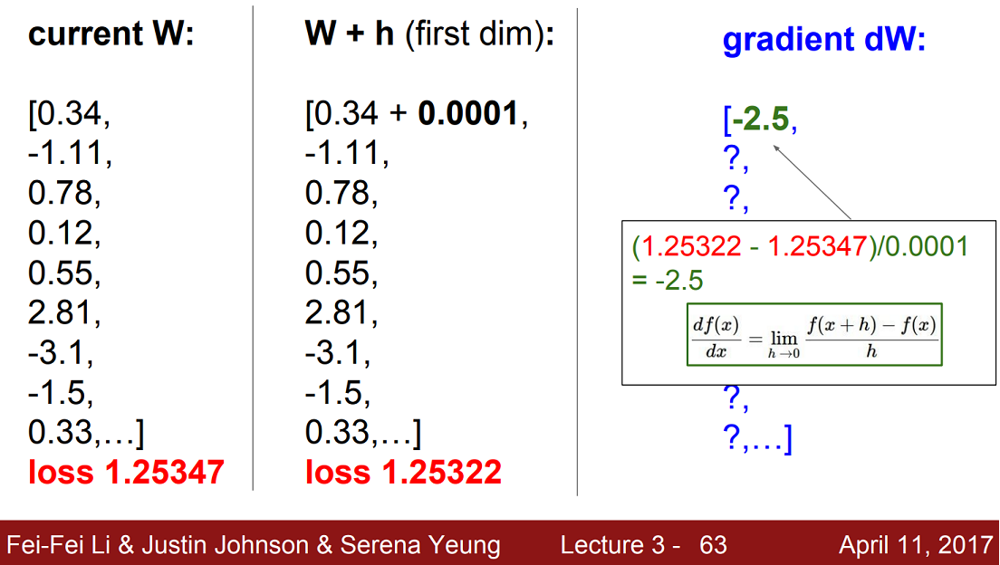
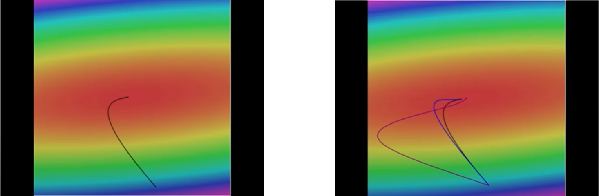

파라미터 $W$를 산과 계곡같은 풍경으로 비유하면 우리는 이 골짜기를 돌아다니는 사람과 같다. 이때 내가 있는 곳의 높이가 Loss인 셈이다. Loss는 $W$에 따라 변하고 이를 최소로 만드는 골짜기의 밑바닥에 해당하는 $W$를 찾는 것이 목표다. 이 과정을 해결하기 위한 방법들을 최적화(Optimization)이라고 한다.

손실 함수(Loss function)과 Regularization 등 모든 것을 분석해서 밑바닥으로 순간이동할 수 있는 minimizer를 만들면 좋겠지만, 실제 Neural Network에서는 이러한 함수들이 매우 크고 복잡하다. 어떤 명시적인 솔루션으로 최적값(minima)를 직접 얻는 것은 불가능에 가깝다. 대신 다양한 반복적인(interative) 방법들을 사용한다. 임의의 지점에서 시작해서 점진적으로 성능을 향상시키는 것이다.

#### 전략 #1: 임의 탐색(Random search)

생각해볼 수 있는 가장 단순한 방법 중 하나로 임의로 샘플링한 $W$를 매우 많이 모아놓고 Loss를 비교하여 어떤 $W$가 좋은지 고르는 방법이다. 이 방법으로 CIFAR-10 데이터셋에서 Linear Classifier를 학습시키면 약 $15%$의 정확도를 얻을 수 있다. $10$개의 클래스 중 하나를 찍었을 때 기대값인 10%보다는 높지만 SOTA(State of the art; 현재 수준에서 가장 정확도가 높은 모델)를 기준으로 성능이 95%정도 나오는 것을 감안하면 거의 못 쓰는 방법이다.

#### 전략 #2: 경사면을 따라 내려가기(Follow the slope)

실제로 더 나은 전략은 지역적인 기하학적 특성(local geometry)을 이용하는 것이다. 골짜기의 밑바닥이 어딘지 눈으로 확인할 수는 없지만 두 발의 감각으로 땅의 경사를 알아낸 뒤 내려갈 수 있는 방향으로 조금 나아간다. 다시 땅의 경사를 알아내고 내려가는 방향으로 또 나아간다. 이를 반복하면 골짜기를 내려갈 수 있다는 접근이다. 세부적인 것만 잘 파악하면 꽤 잘 동작한다고 한다.

## Gradient

1차원 함수 $f$를 예를 들어보자. $f(x) = y$에서 $x$를 입력으로 받으면 출력은 어떤 곡선의 높이가 될 것이다. 이때 함수 $f$의 미분은 다음과 같다.

$$
\dfrac{df(x)}{dx} = \lim_{h \rightarrow 0} \dfrac{f(x+h) - f(x)}{h}
$$

작은 스텝 $h$가 있고 이 스텝 사이의 함수 값의 차이($f(x+h) - f(x)$)를 비교한다. 그리고 스텝의 크기를 0으로 만들면($h \rightarrow 0$), 이 값이 어떤 점에서 이 함수의 경사가 된다.

실제로는 $x$값이 스칼라(scalar) 값이 아닌 벡터(vector)이고, 이는 1차원 함수를 예로 설명한 미분의 개념을 다변수로 확장시켜야 한다는 뜻이다. 이에 따른 벡터 $x$의 각 차원에 대한 편도함수(partial derivatives)의 집합을 **경사도(gradeint)**라고 한다. Gradient의 모양은 $x$와 같고 각 요소들은 해당 방향으로 움직였을 때, 함수 $f$의 경사가 어떤지를 알려준다. 즉, 함수의 어떤 점에서 선형 1차 근사 함수를 알려준다.

Gradient의 방향은 함수에서 가장 가파르게 올라가는 방향을 가르키는데, 반대로 **gradient의 반대(negative gradient)**방향은 가장 가파르게 내려가는 방향과 같다. 특정 방향의 기울기는 그 방향의 단위 벡터(unit vector)와 **내적(dot product)**한 값이 된다.

### Numerical gradient

유한 차분법 (Finite difference methods)으로 구한 gradient의 근사값을 말한다. FDM은 쉽게 말해 $h$에 매우 작은 값을 넣어 미분값을 근사하는 방법이다. 다음과 같은 예를 보자.



현재 $W$에 대한 loss는 $1.25347$이다. 이제 첫 번째 차원의 $0.34$에 아주 작은 $h$값($0.0001$)을 더한 뒤 다시 loss를 계산해보면 $1.25322$로 약간 감소한다. 이제 유한 차분법을 통해 gradient의 근사값을 구하면 $-2.5$가 나온다.

이를 마찬가지로 다른 모든 차원들에 대해서도 반복해주면 gradient의 계산이 가능하다. 하지만 시간이 굉장히 오래 걸려 끔직한 방법이다. 이 예시에서는 $W$가 10개지만, 아주 크고 깊은 신경망에서는 수억개의 파라미터를 다루기도 한다. 한 번 계산하는데, 모든 파라미터에 대해 함수 값을 일일히 다 계산할 수는 없기 때문에 실제로는 쓰일 수가 없는 방법이다.

대신 Loss의 gradient를 계산하는 코드를 직접 작성 중이라고 할 때, FDM으로 구해진 값과 일치하는지 확인하는 디버깅 툴 정도로 활용이 가능하다. 대신 수치적으로 불안정하고 느리기 때문에 파라미터 개수를 줄이고 테스트하는게 좋다고 한다.

### Analytic gradient

결국 loss function은  $W$에 대한 함수이다. 이미 훌륭한 위인들이 만들어 놓은 미분(Differential calculus)이라는 망치로 두들기면 gradient를 계산할 수 있다. 수치적으로 근사값을 구하는 것보다 더 정확하고 식 하나로 모두 계산이 가능하기 때문에 훨씬 빠르다. 실제로 gradient를 계산할 때는 항상 Analytic gradient로 계산한다. 이 방법에 대한 자세한 내용은 다음 강의에서 소개한다.

## 경사 하강법 (Gradient Descent)

Gradient를 계산하는 방법을 알고 나면, 이 값을 이용해서 최적의 $W$를 찾을 일만 남았다. 다음 세 줄의 코드는 크고 복잡한 신경망 알고리즘을 어떻게 학습시킬지에 대한 핵심 아이디어를 담고 있다.

```python
# Vanilla Gradient Descent

while True:
    weights_grad = evaluate_gradient(loss_fun, data, weights)
    weights += - step_size * weights_grad # perform parameter update
```

경사 하강법에서는 먼저 $W$를 임의의 값으로 초기화한다. 그리고 loss와 gradient를 계산한 뒤, 가중치를 gradient의 반대 방향으로 업데이트 한다. 앞서 설명했듯 gradient는 함수에서 가장 가파르게 올라가는 방향이므로 반대인 내려가는 방향으로 나아가는 것이다. 이렇게 조금식 이동하는 과정을 영원히 반복하여 결국 수렴할 것이다.

여기서 `step_size`는 하이퍼파라미터로 gradient의 반대 방향으로 "얼마나 나아갈지"를 나타낸다. **학습률(Learning rate)**라고도 하며, 학습할 때 정해줘야하는 가장 중요한 하이퍼파라미터 중 하나이다. 

> 학습시 모델 사이즈나 Regularization 강도와 같은 것들보다도 가장 먼저 Learning rate를 올바르게 정해준다고 한다.

다음은 2차원 공간에서의 간단한 예시를 보자.



Loss function을 나타낸 것으로 가운데 빨간 부분이 loss가 낮은 부분, 테두리의 푸른 부분들이 loss가 더 높은 곳이다. 임의의 점에 $W$를 설정했을 때, gradient의 반대 방향(negative gradient direction)을 계산하고 가장 낮은 곳으로 나아간다. 이를 계속 반복하다 보면 정확한 최저점에 도달할 것이다. 왼쪽그림에서 기울기를 따라 휘어져 최저점까지 도달하는 것을 볼 수 있다.

오른쪽 그림은 앞으로 배우게 될 또다른 Update rule들을 나타낸 것으로 여러 스텝을 한 번에 고려하는 더 좋은 방법들이다. 기본적인 gradient descent보다 실제로 더 좋은 성능을 보인다. 하지만 결국 기본적인 알고리즘은 매 스텝마다 내려간다는 것이다.

## 확률적 경사 하강법 (Stochastic Gradient Descent)

다시 정리하면

$$
L(W) =  \dfrac{1}{N} \sum^{N}_{i=1} L_i(f(x_i, W), y_i) + \lambda R(W)
$$

앞에서 정의한 loss function $L(W)$는 현재 $W$가 학습 데이터들을 얼마나 나쁘게 분류하는지를 계산하는 함수였다.

$$
\nabla_{W} L(W) = \dfrac{1}{N} \sum^{N}_{i=1} \nabla_{W} L_i(f(x_i, W), y_i) + \lambda \nabla_{W} R(W)
$$

Gradient descent는 loss function $L(W)$를 $W$에 대해 미분하여 계산한 gradient를 통해 $W$를 업데이트하는 과정을 반복해 최저값을 찾으려는 알고리즘이다. ($\nabla_{W}$는 $W$에 대한 gradient라는 뜻이다)

전체 loss는 전체 $N$개의 학습 데이터에 대한 loss 평균으로 계산했다. 하지만 실제로는 $N$이 매우 클 수 있다. ImageNet 데이터셋의 경우, 약 $130$만 장에 이른다. 매번 loss를 계산할 때마다 백만 개 이상의 데이터에 대한 loss를 구한다면 엄청 느린 업데이트가 될 것이다.

그래서 실제로는 **확률적 경사 하강법(stochastic gradient descent)**라는 방법을 사용한다. 전체 데이터 셋의 gradient와 loss를 모두 계산하지 말고, **미니배치(minibatch)**라는 작은 학습 셋들로 나눠 학습하는 방법이다. Minibatch의 gradient와 loss 값을 전체 데이터 셋의 "gradient 추정치"와 "loss 추정치"로 보는 것이다.

SGD는 거의 모든 DNN 알고리즘에서 사용되는 기본적인 학습 알고리즘으로 다음 네 줄로 학습 과정을 나타낼 수 있다.

```python
### Vanilla Minibatch Gradient Descent

while True:
    data_batch = sample_training_data(data, 256) # sample 256 examples
    weights_grad = evaluate_gradient(loss_fun, data_batch, weights)
    weights += - step_size * weights_grad # perform parameter update
```

참고로 Minibatch의 사이즈는 보통 2의 제곱수로 정하며 32, 64, 128 등을 주로 사용한다.

## Interactive Web Demo

<http://vision.stanford.edu/teaching/cs231n-demos/linear-classify/>

위 링크를 통해 Linear classifier를 Gradient descent로 학습시킬 수 있는 Web Demo에 접속할 수 있다. 여러 Loss function을 적용해보며 어떻게 학습이 종료되는지 보고, 다양한 요소들의 trade-off를 비교해보며 다른 점을 이해해보자. 또한 Gradient descent를 통해 Linear classifier를 학습시키는 과정을 직접 보면서 직관을 얻어보도록 하자.