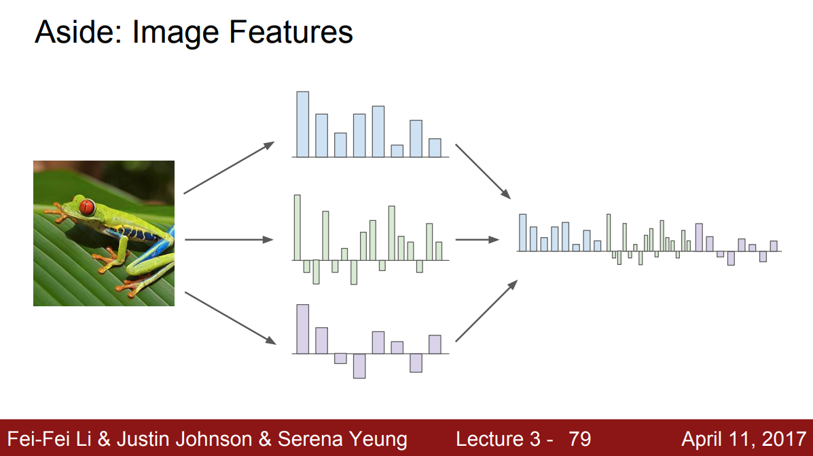
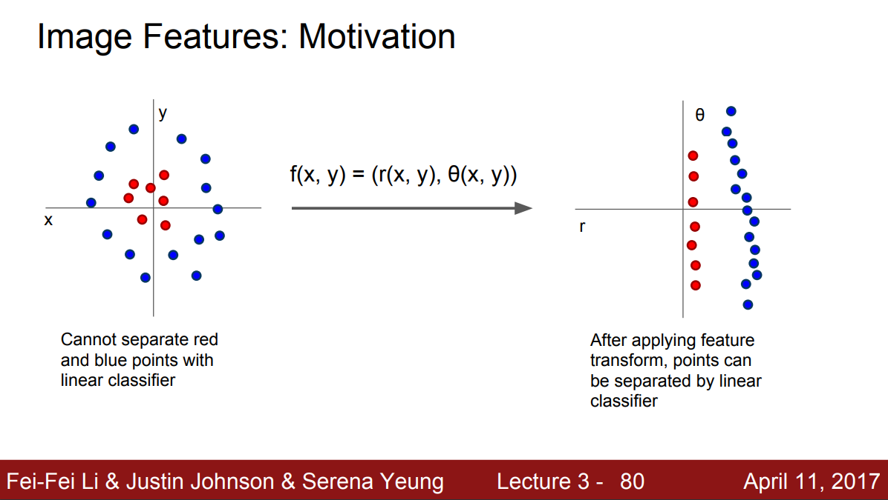
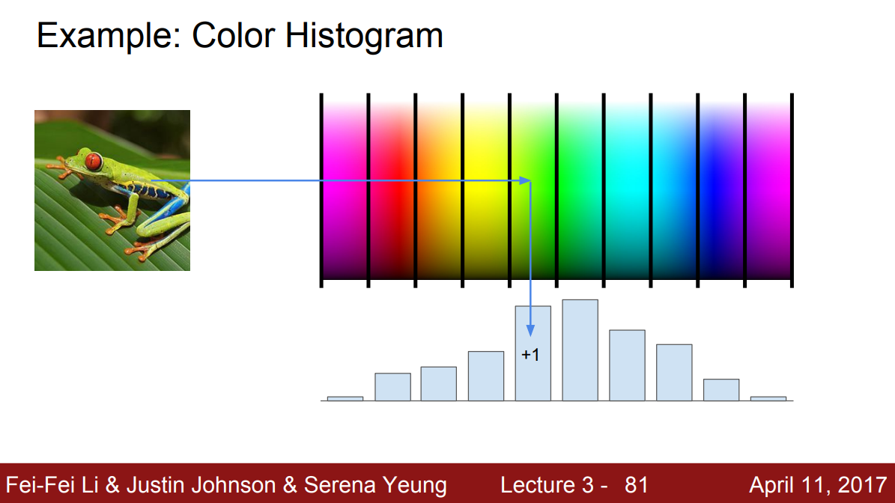
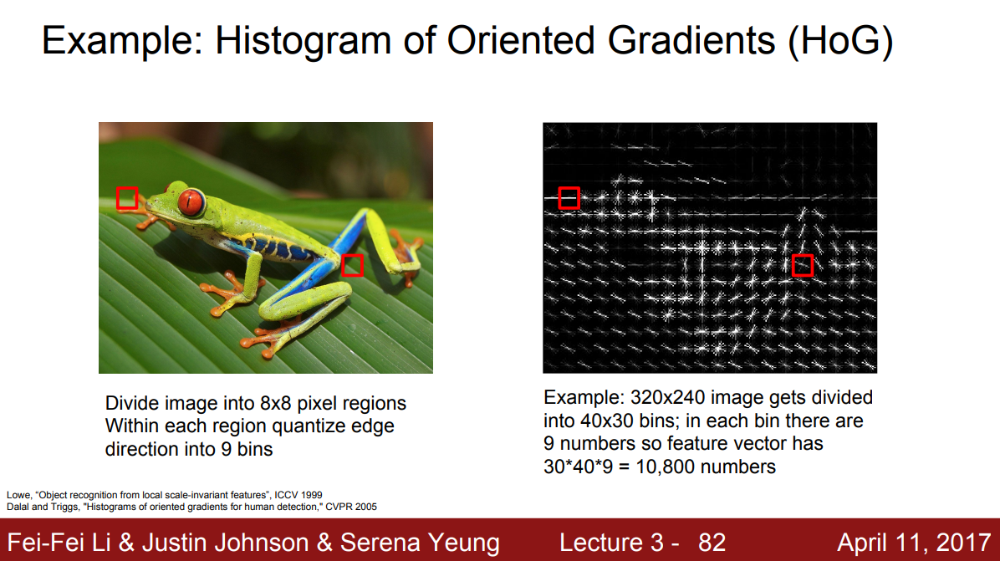
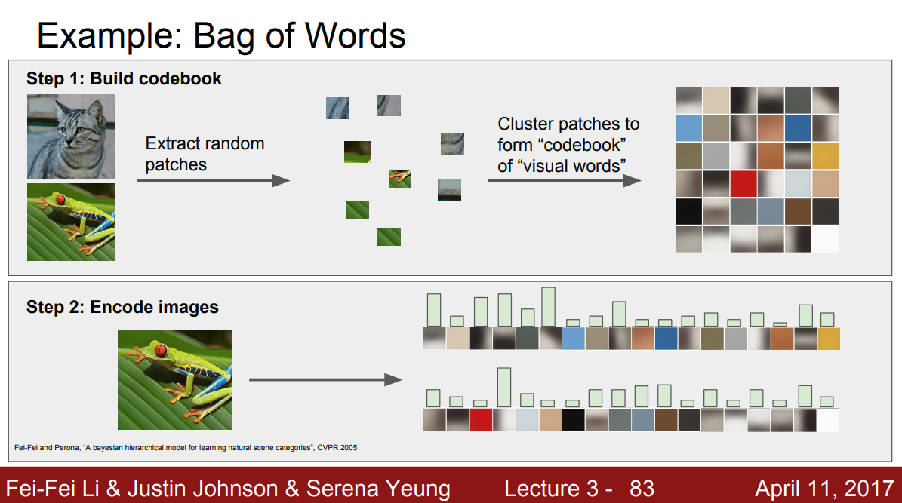
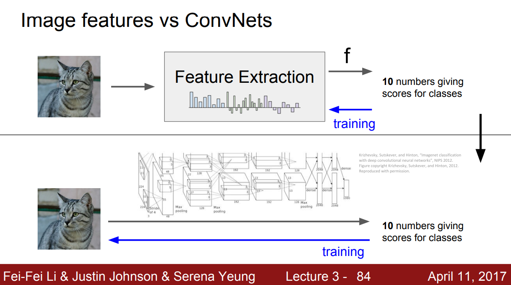

## Feature vector

이전에 간단한 형태의 inear classifier를 소개할 때, 이미지를 픽셀 그대로 입력 받는 방식을 소개했다. 그리고 아주 안 좋은 방법이라는 것을 알 수 있었다. 그래서 딥러닝 이전에는 두 가지 스테이지를 통해 입력을 변환한다.

먼저, 이미지에 대한 여러가지 **특징(feature)**들을 계산한다. 특징은 이미지의 모양새와 관련된 것이 될 수 있다. 그 다음에 이런 특징들의 표현을 연결시켜(concat) 하나의 **특징 벡터(feature vector)**로 계산한다.

이렇게 이미지를 특징 벡터로 변환하는 이유는 쉽게 해결 가능한 형태로 바꾸기 위함이다. 다음 사진의 경우, 빨간 점과 파란 점을 구분할 수 있는 선형적인 경계를 그리기 어렵다. 그런데 이 좌표계를 극 좌표계로 바꾸는 특징 변환을 한다면 복잡해보이는 데이터가 선형으롤 분리가능하게 바뀐다.

이미지 또한 Raw 데이터 형태로 classifier에 입력으로 넣는 것보다는 특징 변환을 한 뒤 넣는게 성능이 더 좋을 것이다.

## Image feature examples

이미지에 관련된 특징 변환 예에는 "컬러 히스토그램"이 있다. 각 픽셀에 존재하는 색상별로 개수를 세서 히스토그램으로 만든 것이다. 이는 이미지가 전체적으로 어떤 색인지를 나타낸다. 개구리 이미지의 경우, 빨간색보다는 확실히 초록색이 더 많다.

또 신경망이 뜨기 전에 유명했던 특징 벡터 중 하나는 HOG(Histogram of Oriented Gradients)이다. 이미지를 작은 구역으로 나눠 각각에서 가장 지배적인 모서리의 기울기를 측정한다. 이렇게 구한 모서리들의 기울기를 양자화해서 히스토그램으로 만드는 것이다. 이는 이미지 내에 전반적으로 어떤 종류의 선들로 이뤄져있는지를 나타낸다. 

또 다른 특징 표현으로는 "Bag of words"가 있다. NLP에서 영감을 받은 것으로 어떤 문장이 있을 때 BOW는 여러 단어의 발생 빈도를 세어 특징 벡터로 사용한다. 이미지에도 이와 같은 직관을 접목했는데, 먼저 많은 이미지를 임의로 조각내어 K-means와 같은 알고리즘으로 군집화시킨다. 이미지 내 많은 요소를 나타낼 수 있는 다양한 군집인 시각 단어(visual words)을 만드는 의미다. 이를 통해 다양한 색, 다양한 방향의 모서리 기울기 등을 나타낼 수 있다. 시간 단어들로 코드북을 만들고 나면, 이 이미지에서 각 시각 단어들의 발생 빈도를 측정할 수 있고 그 빈도로 특징 벡터를 만들 수 있다.

## Image features vs ConvNets

불과 10년 전만해도 입력 이미지에 대해 BOW나 HOG와 같은 방법으로 특징 표현을 계산해서 Linear classifier의 입력으로 사용했다. 특징은 한 번 추출되면 classifier를 학습하는 동안 변하지 않는 값이었다. 오직 classifier만 학습되는 것이다. CNN, DNN들도 크게 다르지 않는데, 가장 큰 차이점은 미리 만들어 놓은 특징을 쓰기보다는 데이터로부터 특징을 직접 학습한다는 것이다.

따라서 이미지가 raw 형태 그대로 입력으로 들어가고, 여러 레이어를 통해 데이터를 통한 특징 벡터를 직접 만들어낸다. 즉, classifier만 학습하는게 아니라 가중치 전체를 학습하는 것이다.