빠르고 정확한 Analytic gradient를 유도하고 사용하는 방법에 대해 배워보자.

## 계산 그래프 (Computational graph)

복잡한 형태의 함수를 나타내기 위해 **계산 그래프(computational graph)**를 사용할 것이다. 기본적으로 계산 그래프를 통해 어떤 함수든 표현 가능하다. 다음 예시는 $W$, $x$를 입력으로 받는 linear classifier를 계산 그래프로 나타낸 것이다.

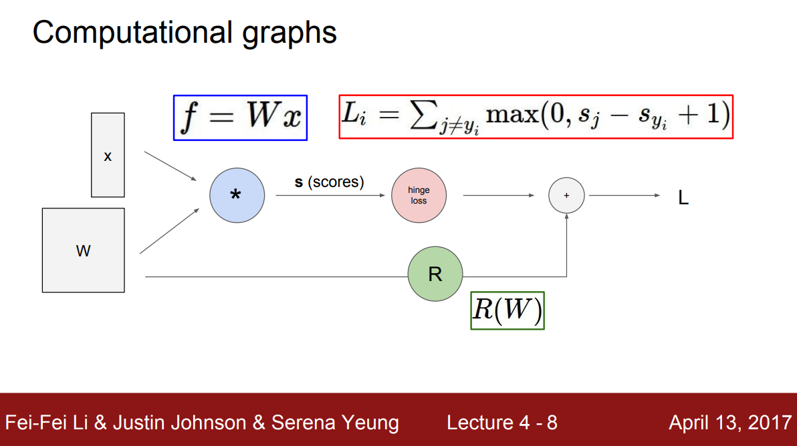

그래프의 각 노드는 연산을 나타내는데, 위의 예에서 곱셈 노드는 행렬 곱을 나타낸다. 파라미터 $W$와 데이터 $x$의 행렬 곱을 곱한 결과로 $s$라는 점수 벡터가 된다는 것을 나타낸다. hinge loss는 $\max$연산을 수행하는 노드로 데이터 항 $L_i$를 계산한다. 오른쪽 하단의 $R(W)$ 노드는 식에는 나와있지 않지만 regularization 항을 계산하는 노드이고, 최종 loss $L$은 데이터 항과 regularization항의 합이 된다.

## 역전파 (Backpropagation)

함수를 계산 그래프로 나타내는 이유는 **역전파(backpropagation)**를 사용하기 위함이다. 역전파는 계산 그래프 내부의 모든 변수에 대해 chain rule을 재귀적으로 사용해서 gradient를 계산하는 기술이다.

다음과 같은 함수 $f(x,y,z)$이 있을 때, $f$의 출력 값에 대한 각 변수의 gradient를 계산해보자.

항상 먼저 함수 $f$를 계산 그래프로 나타낸다. 그림의 오른쪽을 보면 $x$, $y$에 대한 덧셈 노드가 있고 그 다음 연산을 위한 곱셈 노드도 볼 수 있다. 그런 다음 그래프에 입력 값인 $x=-2$, $y=5$, $z=-4$를 전달한다. 그래프를 통과하면서 $f$의 출력 값을 계산하는데, 각 노드의 옆에 중간 계산 값을 적어놓았다. 그리고 이러한 중간 노드들을 변수로 다뤄보자. $x + y$ 덧셈 노드를 $q$라고 부르고, $q \cdot z$ 곱셈 노드 $f$라고 부를 것이다.

이때 $x$, $y$에 대한 $q$의 gradient $\dfrac{\partial q}{\partial x}, \dfrac{\partial q}{\partial y}$는 각각 $1$, $1$이다. 단순한 덧셈에 대해 편미분한 결과다.

그리고 $q$, $z$에 대한 $f$의 gradient $\dfrac{\partial f}{\partial q}, \dfrac{\partial f}{\partial z}$는 곱셈 규칙에 의해 $z$, $q$가 된다.

이제 결과적으로 우리가 원하는 것인 각 입력 $x$, $y$, $z$에 대한 $f$의 gradient $\dfrac{\partial f}{\partial x}, \dfrac{\partial f}{\partial y}, \dfrac{\partial f}{\partial z}$를 구해보자.

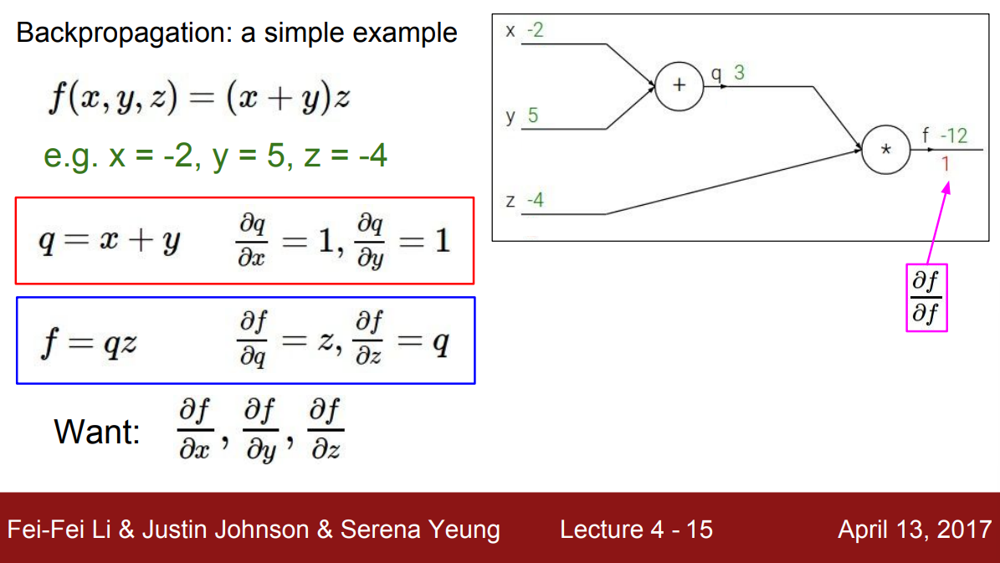

역전파는 **Chain rule**의 재귀적인 응용이다. 이를 위해 계산 그래프의 가장 마지막에서부터 gradient를 계산한다. 맨 마지막 출력 $f$에 대한 $f$의 gradient $\dfrac{\partial f}{\partial f}$는 당연히 $1$이다.

그 뒤에 있는 $z$에 대한 gradient를 계산해보자. $z$에 대한 $f$의 미분 $\dfrac{\partial f}{\partial z}$은 $q$이기 때문에 gradient는 $3$이다.

다음으로 $q$에 대한 $f$의 gradient를 알아보자. $q$에 대한 $f$의 미분 $\dfrac{\partial f}{\partial q}$는 $z$이므로 graident는 $-4$이다.

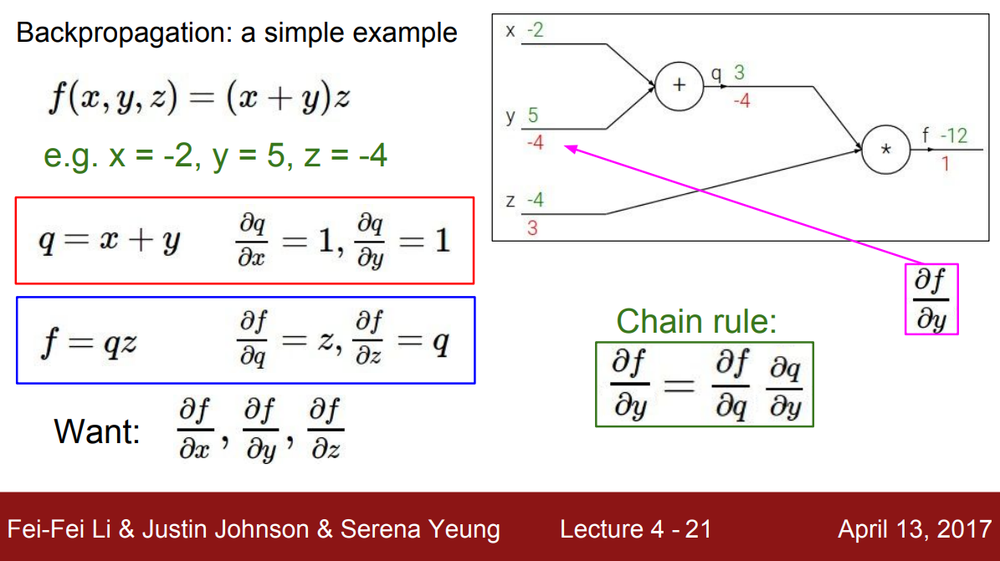

이제 그 뒤으로 가서 $y$에 대한 $f$의 gradient 계산해보자. 그런데 여기서 $y$는 $f$와 그래프 상에서 바로 연결되어 있지 않다. 이때 다음과 같이 chain rule을 이용하여 계산할 수 있다.

$$
\dfrac{\partial f}{\partial y} = \dfrac{\partial f}{\partial q} \dfrac{\partial q}{\partial y}
$$

즉, $y$에 대한 $f$의 미분 $\dfrac{\partial f}{\partial y}$는 $q$에 대한 $f$의 미분 $\dfrac{\partial f}{\partial q}$과 $y$에 대한 $q$의 미분 $\dfrac{\partial q}{\partial y}$의 곱으로 나타낼 수 있다. 각 항은 $z(=-4)$, $1$과 같으므로 gradient는 $-4$이다.

> 직관적으로 $y$가 $f$에 미치는 영향을 구하는 과정으로 이해할 수 있다. 만약 $y$를 조금 변화시키면 $q$는 $y$의 영향력만큼 조금 변하게 된다. 여기서는 $y$를 바꿨을 때 $q$에 $1$만큼 영향을 미친다. 마찬가지로 $q$는 $f$에 $z(=-4)$만큼 영향력을 미치므로 이들을 곱해 $y$는 $f$에 $1 \times -4 = -4$만큼 영향력을 미친다고 계산할 수 있는 것이다.

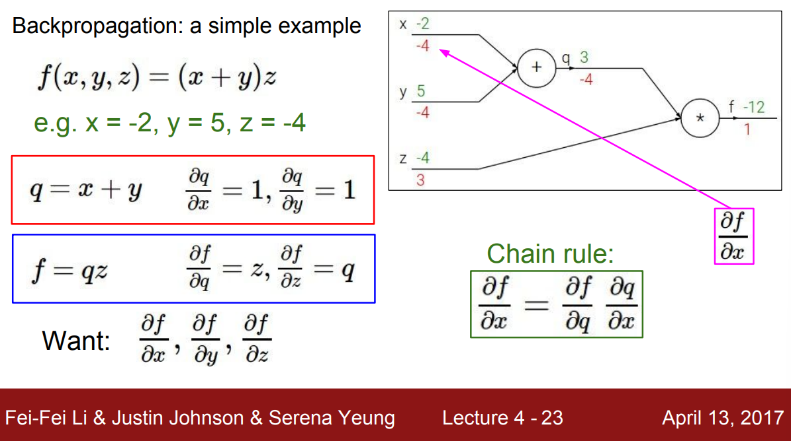

위와 똑같이 $x$에 대한 gradient를 계산해보자. 다시 chain rule을 적용하면, $f$에 대한 $q$의 영향력이 $-4$이고, $x$에 대한 $q$의 영향력은 $1$임을 알고 있으므로 $f$에 대한 $x$의 gradient는 $1 \times -4 = -4$이다.

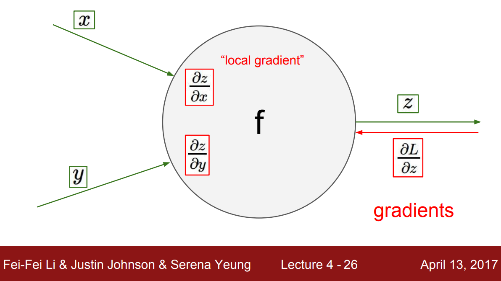

앞에서 설명한 역전파는 계산 그래프 안의 모든 노드에 대해 진행됐다. 그런데 여기서 주목할 점은 각 노드의 계산에는 오직 주변 노드의 정보만 있으면 충분했다.

위 그림은 어떤 노드와 노드의 local 입력 $x$, $y$를 나타낸 것이다. 입력은 노드에 흘러들어와 출력 $z$을 얻게 된다. 그리고 출력에 대한 입력의 변화량인 **local gradient**를 계산할 수 있다. 여기서 local gradient는 $x$에 대한 $z$의 gradient $\dfrac{\partial z}{\partial x}$와 $y$에 대한 $z$의 gradient $\dfrac{\partial z}{\partial y}$이다. 이때 각 노드 연산은 덧셈 또는 곱셈과 같은 간단한 형태이기 때문에 복잡한 미적분학 없이 아주 쉽게 local gradient를 계산할 수 있다.

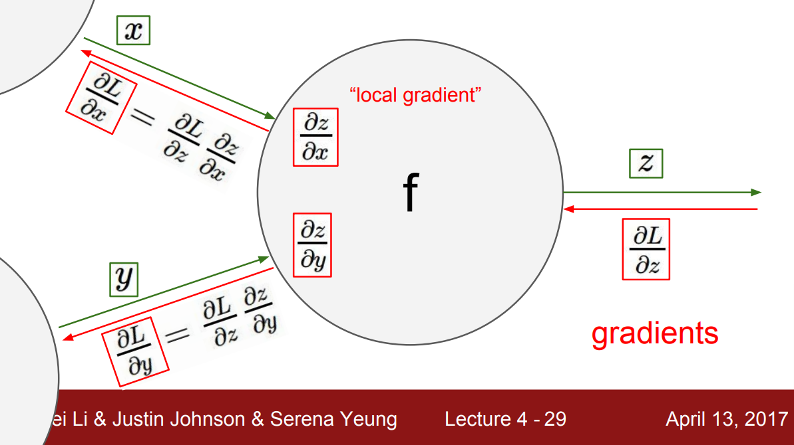

역전파가 전체적으로 어떻게 동작하는지 정리해보자. 그래프의 가장 뒤에서 시작해서 가장 앞 부분으로 gradient가 전파된다. 각 노드에서는 출력 노드의 gradient로부터 local gradient를 계산해서 상류의(입력 쪽의) 노드로 다시 전파한다.

그래서 각 노드에서 $z$에 대한 최종 Loss $L$에 대한 gradient $\dfrac{\partial L}{\partial z}$는 이미 계산되어 있었다. 이 값으로 $x$, $y$에 대한 바로 직전 노드의 gradient를 계산했었고 그 과정에서 chain rule을 사용했었다. $x$에 대한 gradient는 $z$에 대한 gradient와 $x$에 대한 $z$의 local gradient로 합성된다. 이렇게 구한 입력 $x$에 대한 gradient는 그 앞의 노드로 전파됐다. 그래서 chain rule에서는 항상 위쪽으로 gradient가 전파되는 것이다.

중요한 점은 각 노드는 계산하는 과정에서 구한 local gradient 값을 가지고, Backpropagation 시 상위 노드 방향으로 전파되는 gradient를 받아 이 local gradient와 곱하기만 하면 해당 노드의 gradient를 구할 수 있다는 것이다.

### 예제 (Example)

강의에서 꽤 복잡한 함수에 대한 역전파 과정을 세세하게 되집어주고 있다. 역전파 과정을 충분히 이해했다면 쉽게 받아들일 수 있을 것이다. [링크](https://youtu.be/d14TUNcbn1k?t=1110)

결국은 노드마다 간단한 형태의 수식을 정하고 그 유도식을 통해 local gradient를 계산해놓고, 뒤에서 전파되는 gradient와 곱해 다시 전파하는 과정의 반복이다. 여기서 간단한 수식이란 다음과 같은 형태의 함수들을 예로 들고 있다.

$$
\begin{align}
f(x) &= e^x & \rightarrow & \ & \dfrac{\partial f}{\partial x} &= e^x \\
f(x) &= ax & \rightarrow & \ & \dfrac{\partial f}{\partial x} &= a \\
f(x) &= \dfrac{1}{x} & \rightarrow & \ & \dfrac{\partial f}{\partial x} &= - \dfrac{1}{x^2} \\
f(x) &= c+x & \rightarrow & \ & \dfrac{\partial f}{\partial x} &= 1
\end{align}
$$

한 가지 주목할 점은 계산 그래프를 만들 때, 각 노드에 대한 정의를 원하는 대로 세분화 할 수 있다는 점이다. 앞선 예제들에서는 더 이상 쪼갤 수 없는 덧셈, 곱셈으로 노드를 나눴다. 반면, 노드를 더 복잡한 그룹으로 묶을 수 있다는 것이다. 오직 그 노드에 대한 local gradient만 적어 놓으면 역전파 과정은 동일하기 때문이다.

Sigmoid 함수 $\sigma (x)$를 예로 들어보자.

$$
\begin{align}
\sigma (x) &= \dfrac{1}{1 + e ^ {-x}} \\
\dfrac{d\sigma(x)}{dx} &= \dfrac{e^{-x}}{(1+e^{-x})^2} = (\dfrac{1+e^{-x}-1}{1+e^{-x}})(\dfrac{1}{1+e^{-x}}) = (1-\sigma(x))(\sigma(x))
\end{align}
$$

이 함수는 4개의 노드($+$, $\times$, $\exp$, $1/x$)로 나타낼 수도 있겠지만, 이를 직접 미분했을 때 나오는 식인 $(1-\sigma(x))(\sigma(x))$를 계산해냈다면 함수 자체를 큰 노드로 만들 수 있다. 즉, local gradient를 명시할 수 있다면 더 복잡한 노드도 만들 수 있다.

각 노드에서 단순하게 gradient를 계산할지, 많은 수학을 동원하여 간결하고 단순한 그래프를 만들지 사이에서 trade-off를 가진다. 그리고 그 결과로 원하는 만큼 복잡한 형태의 계산 그래프를 활용할 수 있는 것이다.

## Patterns in backward flow

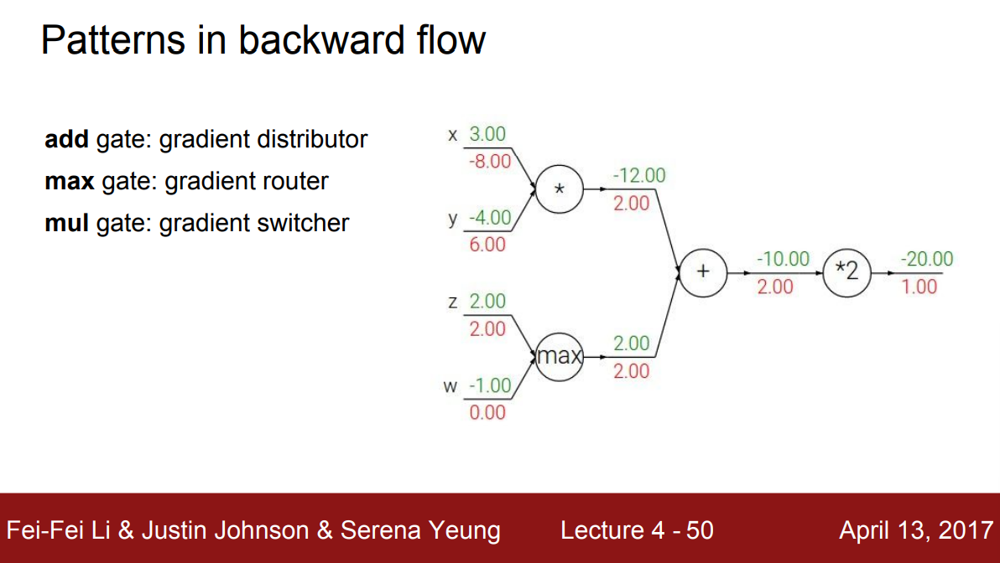

역전파 과정을 직관적으로 해석할 수 있는 패턴이 있다. 덧셈의 경우를 보면 위에서 흘러온 gradient를 연결된 두 입력 노드에 정확히 같은 값으로 나눠준다. 즉, gradient distributor로 볼 수 있다. Max 노드는 흘러온 gradient를 두 입력 노드 중 더 큰 입력 값을 넘긴 노드에게만 전달한다. 다른 노드는 0의 gradient가 흐른다. 즉, gradient router라고 생각할 수 있다. Forward 과정에서 두 노드 중 큰 입력 값을 가진 노드만 함수 계산에 영향을 줬기 때문에 다시 gradient가 전달되어 올 때 그 노드만 고려되는게 자연스럽다. 곱셈 노드는 gradient를 받아 다른 입력노드의 값들로 scaling해서 전달한다. 그래서 gradient switcher로 볼 수 있는 셈이다.

어떤 노드가 여러 노드와 연결되어 있는 경우, 이 노드의 gradient는 위에서 흘러온 gradient들을 합산한 것과 같다. 직관적으로 이 노드가 조금 변할 때, forward pass시 그래프를 따라 연결된 모든 노드들에게 영향을 미친다. 그리고 역전파 시 두 개의 gradient들이 흘러와 다시 이 노드에 영향을 미친다. 따라서 흘러온 gradient들을 모두 더해야 위에서 흘러온 총 gradient가 되는 것이다.

$x$가 함수 $f$에 대해 다변수(mutli-variate) chain rule로 나타내보자.

$$
\dfrac{\partial f}{\partial x} = \sum_{i} \dfrac{\partial f}{\partial q_i} \dfrac{\partial q_i}{\partial x}
$$

$x$는 변수 $i$에 의해 여러 요소들 $q_i$와 연결되어 있다. 그리고 chain rule에 따라 최종 출력 $f$에 $q_i$와 같은 중간 요소들이 미치는 영향을 계산하고, 이 노드에서 $x$가 각 중간 요소 $q_i$들이 미치는 영향인 local gradient를 계산한 뒤 이들을 합쳐 gradient를 구하는 과정으로 이해할 수 있다.

## Gradient for vectorized code

위에서 다룬 예제들은 모두 계산 그래프의 변수들이 스칼라 값을 가지는 경우였다. 이제 벡터 형태일 때 어떻게 되는지 생각해보자.

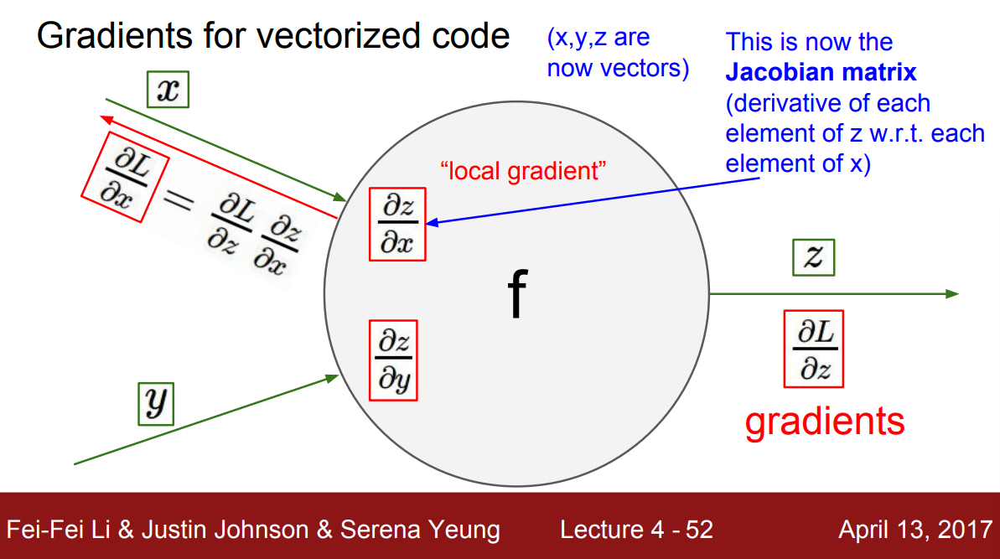

변수 $x$, $y$, $z$는 이제 숫자가 아닌 벡터다. 이에 따라 gradient는 Jacobian Matrix가 될 것이다. 이는 각 요소들의 미분 값을 가지는 행렬이다. 예를 들어, 행렬 $\dfrac{\partial z}{\partial x}$의 각 원소는 $x$의 각 원소에 대한 $z$의 각 원소에 대한 미분을 포함한다.

예를 들어 $4,096$차원의 벡터를 요소별로(elementwse) $0$과의 최대값을 취하는 노드를 생각해보자. 출력은 당연히 입력과 같은 $4,096$차원의 벡터이다. 노드의 Jacobian 행렬의 각 행은 입력에 대한 출력의 편미분이다. 즉, $4,096 \times 4,096$ 크기의 행렬이 될 것이다.

만약 입력 $100$개를 묶은 배치로 처리하는 경우 노드는 더 효율적이지만 Jacobian 행렬은 $4,096,000 \times 4,096,000$으로 너무 커지는 문제가 있다. 다행히도 실제로는 이 거대한 행렬을 계산할 필요가 없다. Jacobian 행렬이 어떻게 생겼는지 생각해보면 알 수 있는데 먼저 행렬의 각 원소인 편미분에 대해 생각해보자. 요소별로 $0$과의 $\max$연산을 하는 노드에서 어떤 입력 차원이 어떤 출력 차원에 영향을 줄까? 당연하게도 요소별 연산이므로 각 차원은 같은 차원에 영향을 준다. 이는 행렬에서 대각원소에만 값을 가진다는 뜻과 같고 나머지는 영향이 없기 때문에 Jacobian 행렬은 대각행렬이 된다.

실제로도 전체 Jacobian 행렬을 작성하고 공식화할 필요는 없다. 출력에 대한 $x$의 영향과 이 값을 사용하는 부분에 대해서만 알면 gradient를 계산할 수 있는 것이다.

### 예제 (A vectorized example)

$n$차원의 $x$와 $n \times n$차원의 $W$에 대한 함수 $f(x,W) = \lVert W \cdot x \rVert ^2$를 에로 들어보자. 계산 그래프는 위에서 볼 수 있듯이 $W$와 $x$를 곱셈 노드로 이은 뒤, $\mathrm{L2}$ 노드가 뒤따른다.

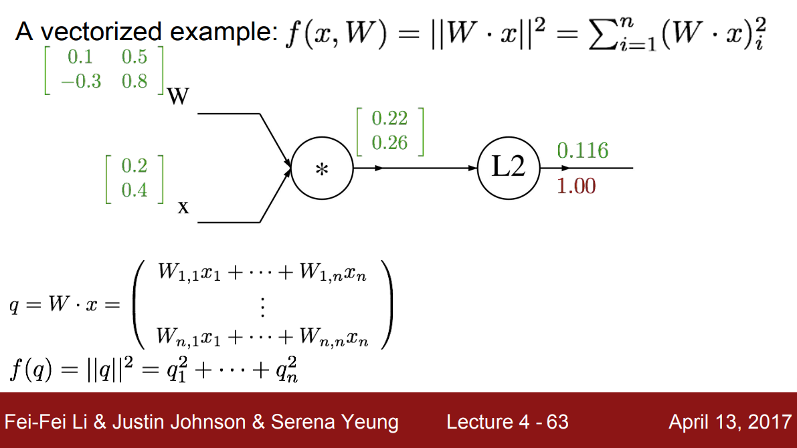

$n=2$를 예로 들면, $x$는 $2$차원 벡터가 되고 $W$는 $2 \times 2$ 크기의 행렬이 된다. 그리고 중간 노드인 $W$와 $x$의 곱셈 결과를 $q$라고 하자. $q$는 $W$와 $x$의 요소별 곱셈의 합으로 나타낼 수 있다. 그리고 $f$를 $q$에 대해 정리한 $f(q)$는 $q$의 L2 norm이고 이는 $q_1^2$부터 $q_n^2$까지 합친 것과 같다.

이제 역전파를 해보자. $f$에 대한 $f$의 gradient는 당연히 $1$로 시작한다. 그런 다음 L2 노드 뒤로 gradient를 전파하기 위해서는 L2 노드 이전 중간 변수인 $q$에 대한 gradient를 구해야 한다. 이때 $q$는 2차원 벡터이므로 $q$에 대한 gradient 역시 2차원 벡터의 형태를 가진다. $q$ 각각의 요소가 $f$의 최종 출력에 영향을 얼마나 미쳤는지를 벡터로 구한 것이기 때문이다.

$q$의 각 요소 $q_i$에 대한 $f$의 미분은 $2q_i$이고 이들을 각 요소로 가지는 gradient는 $\nabla _q f = 2q$로 나타낼 수 있다. 즉, L2 노드에서의 gradient 계산은 $q$를 가져와서 $2$를 곱해 뒤로 전파하는 것과 같다.

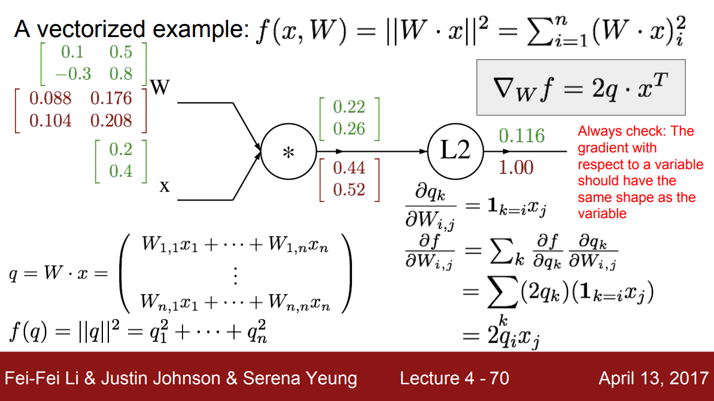

한 번 더 뒤에 있는 노드로 가보자. $W$에 대한 $q$의 local gradient를 계산하기 위해서 $W$의 각 요소가 $q$의 각 요소에 미치는 영향을 알아보자. 사실 이것은 앞에서 말한 Jacobian 행렬과 같다.

여기서 $q$는 $W \cdot x$이다. 즉, $W_{i,j}$에 대한 $q$의 $k$번째 요소의 gradient는 해당 요소의 $x_j$값과 같다. $(\dfrac{\partial q_k}{\partial W_{i,j}} = \mathbf{1}_{k=i} x_j)$

이때 $\mathbf{1}_{k=i}$는 $k=i$이면 $1$, 아니면 $0$이라는 뜻이다.

그런 다음 각 $W_{i,j}$마다 $f$에 대한 gradient를 찾기 위해 chain rule을 사용해보자. 여기서 $q_k$에 대한 $f$의 미분 $\dfrac{\partial f}{\partial q_k}$을 $W_{i,j}$의 각 요소인 $\dfrac{\partial q_k}{\partial W_{i,j}}$과 합성한다. 그래서 우리는 $W$의 각 요소들이 $q$의 각 요소 대해 미치는 영향을 계산하는 식을 정리했고, $q$의 모든 요소들에 대해 이를 더했다. 결과적으로 식을 정리하면 $2q_ix_j$와 같은 식을 얻을 수 있고, $W$에 대한 gradient를 계산할 수 있다

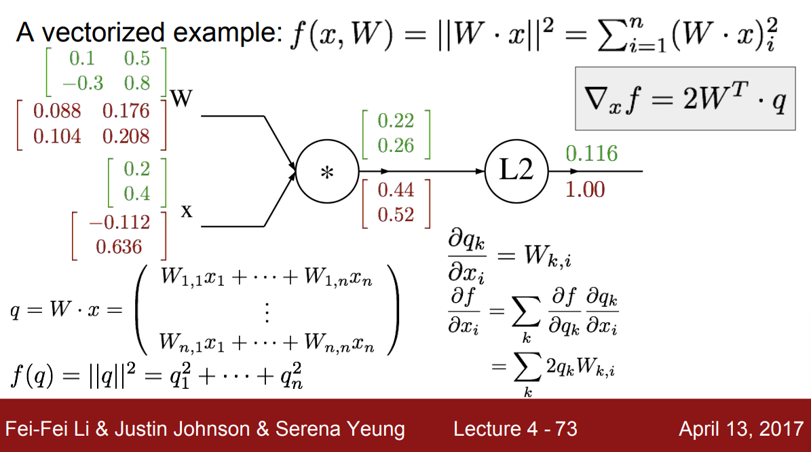

마지막으로 x에 대한 gradient를 구하자. $x$의 $i$번째 요소 $x_i$에 대한 $q$의 $k$번째 요소 $q_k$에 대한 미분은 $W_{k,i}$임을 알 수 있다. 마찬가지로 chain rule을 적용해 식을 정리하면 $\nabla _x f = 2W^T \cdot q$과 같은 식을 얻을 수 있고 이는 $x$와 같은 모양을 가지는 $x$에 대한 gradient가 된다.

## Modularzied implementation

앞서 배운 방식들은 모듈화된 구현이 가능하다. 각 노드를 local하게 보면서 upstream gradient와 함께 chain rule을 이용해 local gradient를 계산했다. 이를 forward pass, backward pass의 API로 생각할 수 있다. forward pass에서는 입력을 받아 노드의 출력을 계산하는 함수를 구현하고, backward pass에서는 chain rule에 따라 gradient를 계산하는 것이다. 

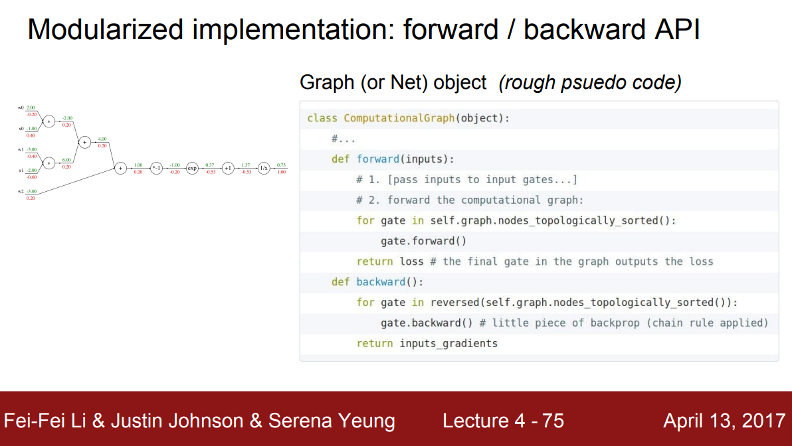

이렇게 구현해둔다면 노드(= 게이트)로 이뤄진 전체 그래프를 만들어 모든 노드를 반복해서 호출함으로써 전체 그래프의 forward pass를 계산할 수 있다. 단, 위치적으로 순서를 잘 정렬해서 어떤 노드를 처리하기 전에 이 노드로 들어오는 모든 입력 노드가 먼저 처리되도록 호출해야할 것이다. backward pass도 마찬가지로 역순서로 모든 게이트를 거꾸로 호출한다.

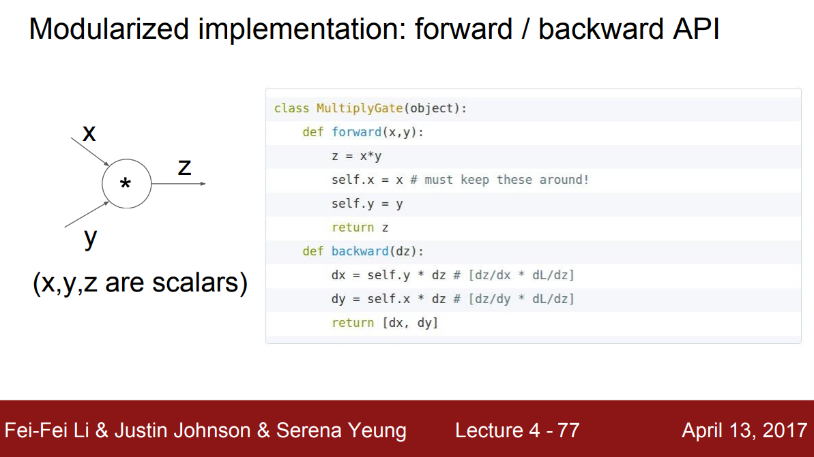

다음 곱셈 게이트를 보자. `x`, `y`를 입력으로 받아 결과로 `z`를 반환한다. backward로 진행할 때는 upstream gradient인 `dz`를 입력받아 `x`와 `y`에 gradient를 전달한다. (예제에서는 scalar 값을 쓰고 있음)

그리고 forward시 중요한 점은 forward pass시 값을 저장(cache)해야한다는 것이다. forward pass가 끝나고 bacward pass에서 이 값이 필요하기 때문이다. 곱셈 게이트의 경우, gradient에 이전 입력 값을 switch하여 곱해주기 때문에 반드시 forward시 입력 값이 필요하다는 것을 알 수 있다.

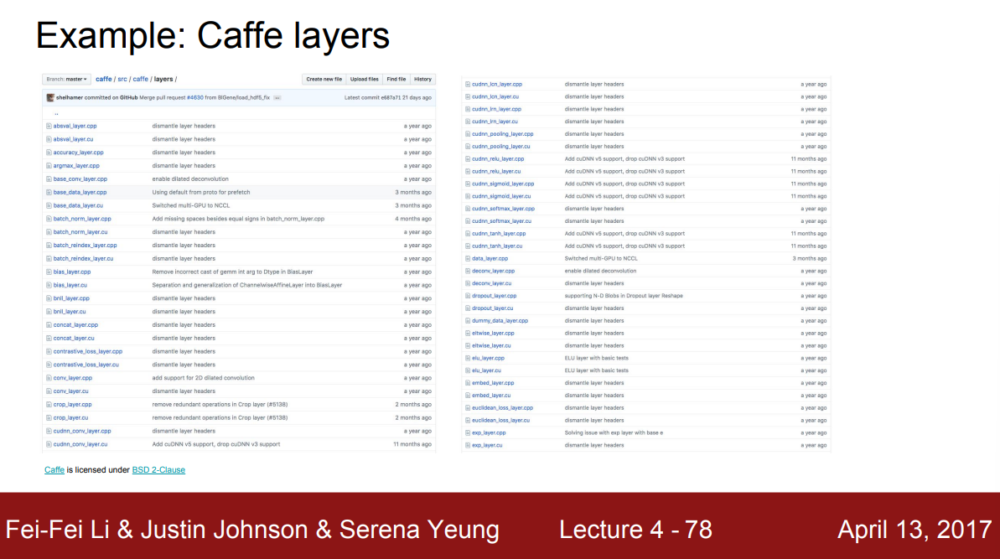

실제 유명한 딥러닝 프레임워크들 또한 이러한 모듈화를 따른다. 코드를 볼 수 있는 Caffe의 경우, layer라고 부르는 폴더를 보면 computational mode의 전체 목록을 볼 수 있다. 앞에서 예로 든 sigmoid를 비롯해서 convolution, argmax 등 실제로는 더 복잡한 수준으로 모듈화되어 있는 것을 알 수 있다.

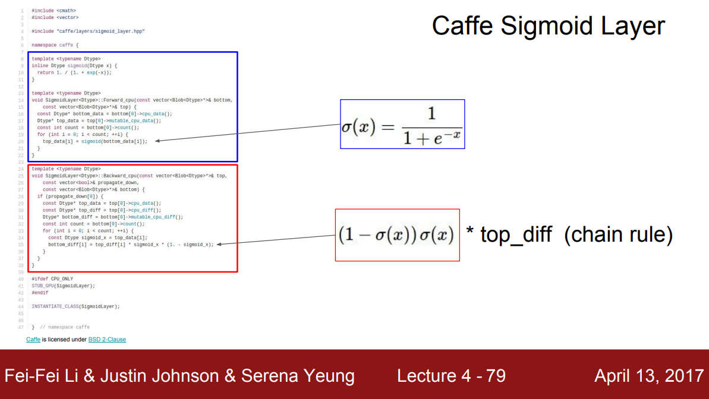

Caffe의 sigmoid layer를 보면 실제로 sigmoid와 똑같은 계산을 수행하고, backward pass에서도 upstream gradient인 `top-diff`를 취해 계산한 local gradient와 곱해주는 것을 알 수 있다.

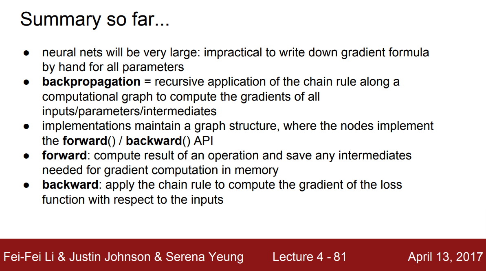