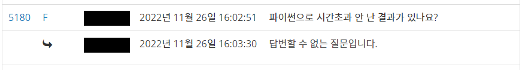

대회 문제는 백준 온라인 저지에 공개되어있다. <https://www.acmicpc.net/category/697>

## A. WARBOY (BOJ 26082)

```python
import sys

input = lambda: sys.stdin.readline().strip('\n')

for T in range(1):
    a, b, c = map(int, input().split())
    print(b // a * c * 3)
```

## B. 유통기한 (BOJ 26083)

```python
import sys

input = lambda: sys.stdin.readline().strip('\n')

md = [[0, 31, 29, 31, 30, 31, 30, 31, 31, 30, 31, 30, 31],
      [0, 31, 28, 31, 30, 31, 30, 31, 31, 30, 31, 30, 31]]


def solve():
    def chk(y, m, d):
        return (y, m, d) >= (Y, M, D) if 1 <= m <= 12 and 1 <= d <= md[1 if y % 4 else 0][m] else -1

    ret = []
    for line in ABC:
        A, B, C = map(int, line.split())

        v = [chk(A, B, C), chk(C, B, A), chk(C, A, B)]
        if v == [-1, -1, -1]:
            ret.append("invalid")
        elif False in v:
            ret.append("unsafe")
        else:
            ret.append("safe")
    return '\n'.join(ret)


for T in range(1):
    Y, M, D = map(int, input().split())
    N = int(input())
    ABC = [input() for _ in range(N)]

    print(solve())
```

## C. DPS (BOJ 26084)

```python
import sys

input = lambda: sys.stdin.readline().strip('\n')


def solve():
    cnta = [0] * 256
    for it in a:
        cnta[ord(it[0])] += 1

    cnts = [0] * 256
    for it in s:
        cnts[ord(it)] += 1

    ret = 1
    for i, cnt in enumerate(cnts):
        if cnt == 1:
            ret *= cnta[i]
        elif cnt == 2:
            ret *= cnta[i] * (cnta[i] - 1) // 2
        elif cnt == 3:
            ret *= cnta[i] * (cnta[i] - 1) * (cnta[i] - 2) // 6
    return ret


for T in range(1):
    s = input()
    n = int(input())
    a = [''] * n
    for i in range(n):
        a[i] = input()
    print(solve())
```

## D. 효구와 호규 (Easy) (BOJ 26085)

```python
import sys

input = lambda: sys.stdin.readline().strip('\n')


def solve():
    for x in [0, 1]:
        if sum([a[i].count(x) for i in range(n)]) % 2:
            return -1
    for i in range(n):
        for j in range(m):
            if i + 1 < n and a[i][j] == a[i + 1][j]:
                return 1
            if j + 1 < m and a[i][j] == a[i][j + 1]:
                return 1
    return -1


for T in range(1):
    n, m = map(int, input().split())
    a = [list(map(int, input().split())) for i in range(n)]

    print(solve())
```

## E. 어려운 스케줄링 (BOJ 26086)

`collections`모듈의 `deque`을 이용하면 더 간단하게 구현할 수 있다.

```python
import sys

input = lambda: sys.stdin.readline().strip('\n')


def solve():
    lst = max([i if q == 1 else 0 for i, (q, *p) in enumerate(qry)])
    flp = sum([q == 2 for q, *p in qry[:lst]]) % 2 == 0
    prv = sorted([p[0] for q, *p in qry[:lst] if q == 0], reverse=flp)
    prv = [prv, prv[::-1]]

    add = [[], []]
    for q, *p in qry[lst:]:
        if q == 0:
            add[flp].append(p[0])
        elif q == 2:
            flp = not flp
    return (add[flp][::-1] + prv[flp] + add[not flp])[k - 1]


for T in range(1):
    n, q, k = map(int, input().split())
    qry = [tuple(map(int, input().split())) for _ in range(q)]

    print(solve())
```

## F. 피보나치와 마지막 수열과 쿼리 (BOJ 26087)

Path compression 과정을 반복문으로 구현하고 쿼리의 특성을 이용하여 Update 쿼리 잘 날리는 등 많은 최적화가 필요하다.

```python
import sys

input = lambda: sys.stdin.readline().strip('\n')


def solve():
    p = [0] * (n + 1)
    f = [0] * (n + 1)

    def find(x):
        if not p[x]:
            return x

        y = x
        while p[y]:
            y = p[y]
        while p[x]:
            nxt = p[x]
            p[x] = y
            x = nxt
        return y

    f[1] = 1
    f[2] = 2
    for i in range(3, n + 1):
        f[i] = (f[i - 1] + f[i - 2]) % 1000000007

    a = [0] * n
    for line in reversed(lr):
        buf = line.split()
        l = int(buf[0]) - 1
        r = int(buf[1]) - 1
        i = l
        while True:
            if not a[i]:
                a[i] = f[i - l + 1]
            i = find(i) + 1
            if i <= r:
                p[i - 1] = i
            else:
                break
    return a


for T in range(1):
    n = int(input())
    q = int(input())
    lr = sys.stdin.readlines()

    print(' '.join(map(str, solve())))
```

## G. 트리 다듬기 (BOJ 26088)

```python
import sys

input = lambda: sys.stdin.readline().strip('\n')


def solve():
    def bfs(x):
        q = [(x, -1)]
        return [(to, x) for x, p in q for to in adj[x] if to != p and not q.append((to, x))]

    r, _ = bfs(0)[-1]
    q = bfs(r)[::-1]

    d = [1] * n
    for x, p in q:
        d[p] = max(d[p], d[x] + 1)

    e = [[] for _ in range(n)]
    for x, p in q:
        e[p].append(d[x])
    return d[r] - 1 + sum(sorted([dx for ee in e for dx in sorted(ee)[:-1]], reverse=True)[:k])


for T in range(1):
    n, k = map(int, input().split())
    adj = [[] for _ in range(n)]
    for _ in range(n - 1):
        u, v = map(int, input().split())
        adj[u - 1].append(v - 1)
        adj[v - 1].append(u - 1)

    print(solve())
```

## H. 완전한 수열 리버스 (BOJ 26089)

가독성을 버리면 한 줄로도 구현이 가능한 문제.

```python
import sys

input = lambda: sys.stdin.readline().strip('\n')


def solve():
    if m % 3:
        return (([2, 0] * n)[:m // 3 * 2 + m % 3 + 1] + [4] * n)[:n]
    else:
        return (([0, 2] * n)[:m // 3 * 2 + m % 3 + 1] + [4] * n)[:n]


for T in range(1):
    n = int(input())
    m = int(input())
    print(' '.join(map(str, solve())))
```

---

## 여담

이번 2022년 서강대학교 프로그래밍 경시대회에 검수진으로 활동했다. 대회 개최 후 운영진의 정답 코드를 공개할 의무는 없지만, 대회 중 다음과 같은 질문을 받고 공개하기로 했다.


본 대회의 규칙에 따르면 **C++ 외에는 정답 코드를 보장하지 않는다.** 하지만 신입생 및 저학년을 대상으로하는 Master 부문은 내부적으로는 가장 느린 파이썬까지 보장하기 위해 최대한 노력한다. 아직 언어간 차이를 이해하지 못하여 대회에서의 유불리를 판단하기 힘들 수 있기 때문이다.

이번 대회는 내가 모든 문제가 파이썬으로 작성한 정답 코드가 있었다. 몇 개의 문제는 굉장한 최적화가 필요하다. 위의 코드를 참고하여 언어간 차이를 발견하고, 본인의 목적(코딩 테스트, 프로그래밍 경진대회 등)에 맞게 주력 언어를 선택할 수 있기를 바란다.